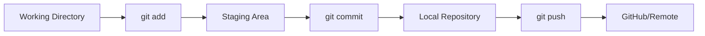

# 

# **Git Installation & Setup** ⚙️

### Versionshantering för alla plattformar

---

## **Vad är Git egentligen?** 🤔

### **Git = Tidsmaskin för kod** ⏰

- **Spårar ändringar** i era filer över tid
- **Håller koll på versioner** - "vad ändrade jag igår?"
- **Samarbete utan kaos** - flera utvecklare, samma projekt
- **Backup på steroider** - aldrig förlora kod igen!

**Analogi:** Som "Track Changes" i Word, fast för all kod! 📝

---

## **Installation: Windows** 🪟

### **Alternativ 1: Git för Windows (Rekommenderat)**

1. **Ladda ner:** [git-scm.com](https://git-scm.com/download/win)
2. **Kör installer** med dessa inställningar:
   - ✅ Git Bash + Git CMD
   - ✅ Use Visual Studio Code as default editor
   - ✅ Override the default branch name: "main"
   - ✅ Git from command line and 3rd-party software

**Bonus:** Får Git Bash (Unix-liknande terminal på Windows)! 🎉

---

## **Installation: macOS** 🍎

### **Alternativ 1: Homebrew (Populärast)**
```bash
# Installera Homebrew först
/bin/bash -c "$(curl -fsSL https://raw.githubusercontent.com/Homebrew/install/HEAD/install.sh)"

# Sedan Git
brew install git
```

### **Alternativ 2: Direkt download**
- **Ladda ner:** [git-scm.com/download/mac](https://git-scm.com/download/mac)

### **Alternativ 3: Xcode Command Line Tools**
```bash
xcode-select --install
```

---

## **Installation: Linux** 🐧

### **Ubuntu/Debian:**
```bash
sudo apt update
sudo apt install git
```

### **Fedora:**
```bash
sudo dnf install git
```

### **Arch Linux:**
```bash
sudo pacman -S git
```

### **CentOS/RHEL:**
```bash
sudo yum install git
```

---

## **Första Setup (Viktigt!)** ⚙️

### **Konfigurera identitet:**

```bash
# Ditt namn (visas i commit history)
git config --global user.name "Ditt Riktiga Namn"

# Din email (samma som GitHub!)
git config --global user.email "din.email@student.campusmolndal.se"
```

### **Andra viktiga inställningar:**
```bash
# Default branch namn
git config --global init.defaultBranch main

# Bättre färger i terminal
git config --global color.ui auto

# Editor för commit meddelanden
git config --global core.editor "code --wait"
```

---

## **Verifiera Installation** ✅

### **Testa dessa kommandon:**

```bash
# Kolla Git version
git --version

# Visa konfiguration
git config --list

# Kolla användarinfo
git config user.name
git config user.email
```

### **Förväntat resultat:**
```
git version 2.40.0 (eller nyare)
user.name=Ditt Namn
user.email=din.email@example.com
```

---

## **SSH Nycklar (Säkerhet)** 🔐

### **Varför SSH keys?**
- **Säkrare** än lösenord
- **Bekvämare** - inget lösenord varje gång
- **GitHub rekommenderar** SSH för alla operationer

### **Generera SSH key:**
```bash
# Ed25519 (modern och säker)
ssh-keygen -t ed25519 -C "din.email@student.campusmolndal.se"

# Tryck Enter 3 gånger (default lokation + inget lösenord för nu)
```

---

## **Lägg till SSH key till GitHub** 🔗

### **Steg 1: Kopiera public key**
```bash
# Windows/Linux
cat ~/.ssh/id_ed25519.pub

# macOS (kopierar direkt)
pbcopy < ~/.ssh/id_ed25519.pub
```

### **Steg 2: GitHub Settings**
1. **GitHub.com** → **Settings** → **SSH and GPG keys**
2. **Click:** "New SSH key"
3. **Title:** "Campus Mölndal Laptop" (eller liknande)
4. **Paste** key content
5. **Add SSH key**

---

## **Testa SSH Connection** 🧪

```bash
# Testa anslutning till GitHub
ssh -T git@github.com
```

### **Första gången:**
```
The authenticity of host 'github.com' can't be established.
Are you sure you want to continue connecting (yes/no)? yes
```

### **Framgång ser ut så här:**
```
Hi [username]! You've successfully authenticated,
but GitHub does not provide shell access.
```

---

## **Git Workflow - Grunderna** 🔄

<div class="mermaid">



</div>

### **De tre områdena:**
1. **Working Directory** - era filer som ni redigerar
2. **Staging Area** - förberedda ändringar
3. **Repository** - sparad historik

---

## **Grundläggande Git Kommandon** ⌨️

### **Repository hantering:**
```bash
git init              # Starta nytt repository
git clone [url]       # Kopiera från GitHub
git status            # Vad händer just nu?
```

### **Ändra och spara:**
```bash
git add [fil]         # Lägg till fil till staging
git add .             # Lägg till alla ändringar
git commit -m "msg"   # Spara med meddelande
```

### **Synka med GitHub:**
```bash
git push              # Skicka till GitHub
git pull              # Hämta från GitHub
```

---

## **Git i olika IDE:er** 💻

### **Visual Studio:**
- **Solution Explorer** → högerclick → "Add Solution to Source Control"
- **Git Changes** panel för commits
- **Team Explorer** för GitHub integration

### **Rider:**
- **VCS** → "Enable Version Control Integration"
- **Commit** panel (Alt+0)
- **Git** menu för alla operationer

### **VS Code:**
- **Source Control** panel (Ctrl+Shift+G)
- **GitLens extension** för superpowers
- **Terminal** för Git commands

---

## **Första Projekt Workflow** 🚀

### **Scenario: Ladda upp ett C# projekt**

```bash
# 1. Gå till projekt mapp
cd /path/to/your/csharp/project

# 2. Initiera Git
git init

# 3. Lägg till remote (GitHub repo)
git remote add origin git@github.com:username/repo-name.git

# 4. Lägg till alla filer
git add .

# 5. Första commit
git commit -m "Initial commit: Added C# console application"

# 6. Skicka till GitHub
git push -u origin main
```

---

## **Vanliga Begynnarmisstag** ⚠️

### **Misstag #1: Glömma .gitignore**
```bash
# Lägg till .gitignore INNAN första commit!
# Annars committas bin/, obj/, .vs/ mappar
```

### **Misstag #2: Stora filer**
```bash
# Git gillar inte filer > 100MB
# Använd Git LFS för stora filer
```

### **Misstag #3: Känslig data**
```bash
# ALDRIG committa:
# - Lösenord, API keys
# - appsettings.Development.json
# - Personlig information
```

---

## **Git Best Practices** 👍

### **Commit meddelanden:**
```bash
# Bra commit meddelanden
git commit -m "Add user authentication feature"
git commit -m "Fix null reference exception in UserService"
git commit -m "Update README with installation instructions"

# Dåliga commit meddelanden
git commit -m "fix"
git commit -m "stuff"
git commit -m "asdf"
```

### **Commit ofta, små ändringar:**
- **1 feature = 1 commit**
- **Fungerande kod varje commit**
- **Beskrivande meddelanden**

---

## **Troubleshooting** 🔧

### **Problem: "Permission denied (publickey)"**
```bash
# Lösning: SSH key inte korrekt installerad
ssh-add ~/.ssh/id_ed25519
ssh -T git@github.com
```

### **Problem: "Repository not found"**
```bash
# Lösning: Fel URL eller inte access
git remote -v                    # Kolla URL
git remote set-url origin [ny-url]  # Ändra URL
```

### **Problem: Merge conflicts**
```bash
# Lösning: Manuell konflikt-lösning (nästa lektion!)
git status     # Se vilka filer har konflikter
# Editera filerna, ta bort <<<< >>>> markeringar
git add .      # Lägg till lösta konflikter
git commit     # Avsluta merge
```

---

## **Git Alias (Pro Tips)** ⚡

### **Spara tid med förkortningar:**

```bash
# Sätt upp praktiska alias
git config --global alias.st status
git config --global alias.co checkout
git config --global alias.br branch
git config --global alias.ci commit
git config --global alias.unstage 'reset HEAD --'

# Nu kan ni skriva:
git st      # istället för git status
git ci      # istället för git commit
```

---

## **Installation Checklist** ✅

Efter denna lektion ska ni ha:

- [ ] Git installerat på er dator
- [ ] Användarnamn och email konfigurerat
- [ ] SSH keys genererade och tillagda till GitHub
- [ ] Testat SSH connection till GitHub
- [ ] Förstått grundläggande Git workflow
- [ ] Skapat ert första lokala repository
- [ ] Synkat med GitHub framgångsrikt

---

## **Nästa steg: Git Workflow** ⏭️

Nu när Git är installerat:

1. **Lära Git ritual:** add → commit → push 🔄
2. **Hantera konflikter** när flera utvecklare samarbetar 🤝
3. **Branching strategies** för större projekt 🌳
4. **GitHub advanced features** (Pull Requests, Issues) 📋

**Målet:** Bli bekväma med daglig Git-användning! 💪

---

## **Resurser & Hjälp** 📚

**Git Dokumentation:** [git-scm.com/doc](https://git-scm.com/doc)

**Interaktiv tutorial:** [learngitbranching.js.org](https://learngitbranching.js.org/)

**GitHub Docs:** [docs.github.com](https://docs.github.com)

**Git Cheat Sheet:** [education.github.com/git-cheat-sheet](https://education.github.com/git-cheat-sheet)

**Pro Git Book:** [git-scm.com/book](https://git-scm.com/book) (gratis!)

---

## **Källor & Resurser** 📚

**Bild på titelsidan:** Foto av Pixabay via Pexels - [Länk](https://images.pexels.com/photos/11035380/pexels-photo-11035380.jpeg)

**Git Official:** [git-scm.com](https://git-scm.com)

**GitHub SSH Setup:** [docs.github.com/en/authentication/connecting-to-github-with-ssh](https://docs.github.com/en/authentication/connecting-to-github-with-ssh)
