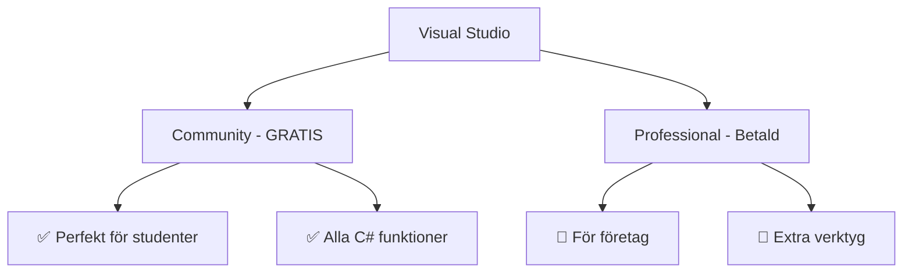

# 

# **Visual Studio Installation** 💻
### Er utvecklingsmiljö för C#

---

## **Varför Visual Studio?** 🤔

Visual Studio är som en **Ferrari för C#-utveckling**! 🏎️

- **Microsoft-gjord** = perfekt för C# 🎯
- **IntelliSense** = AI som hjälper er skriva kod ✨
- **Debugger** = röntgen för er kod 🔍
- **Gratis Community-version** = ingen ursäkt! 💰

**Tl;dr:** Det bästa verktyget för att lära sig C# - punkt slut!

---

## **VS Community vs VS Professional** ⚖️



**För oss:** Community räcker mer än väl! 🎓

---

## **System-krav** 📋

### **Windows (Rekommenderat):**
- Windows 10/11 
- 4GB RAM (8GB bättre)
- 2-4GB diskutrymme
- Internetanslutning

### **Mac:**
- macOS 10.15+
- 4GB RAM 
- 1GB diskutrymme

### **Linux:**
- VS Code + C# Extension (alternativ)

---

## **Installations-guide Windows** 🪟

### **Steg 1-3: Ladda ner och starta**

1. **Gå till:** [visualstudio.microsoft.com](https://visualstudio.microsoft.com/vs/community/)
2. **Klicka:** "Download Visual Studio Community" 
3. **Kör:** `VisualStudioSetup.exe`

### **Steg 4: Välj Workloads**
✅ **.NET desktop development**
✅ **ASP.NET and web development** 
⭐ **Optional:** Game development, Mobile

---

## **Installations-guide Mac** 🍎

### **Visual Studio för Mac:**

1. **Ladda ner:** VS for Mac från Microsoft
2. **Dra till Applications** 📁
3. **Första start:** Logga in med Microsoft-konto
4. **Välj:** .NET templates

**Tips:** VS Code fungerar också bra på Mac! 💡

---

## **Första intryck** 👀

När ni startar första gången:

```csharp
// Detta kommer ni se:
File → New → Project...
   → Console App (.NET Core)
   → "HelloWorld"
   
// Er första kod:
Console.WriteLine("Hej Visual Studio!");
```

**F5 = Run** 🏃‍♂️ (viktigaste knappen!)

---

## **Viktiga funktioner att känna till** 🛠️

### **IntelliSense = Er bästa vän** 🤖
- Föreslår kod medan ni skriver
- Visar fel innan ni kör programmet  
- Autocomplete = mindre skrivande

### **Solution Explorer** 📁
- Er projekthanterare
- Alla filer och mappar
- Högerklick = magi! ✨

---

## **Pro-tips för nybörjare** 💡

### **Theme:** 
Dark Theme = utvecklare-street-cred 😎

### **Extensions att installera:**
- **Visual Studio IntelliCode** (AI-hjälp)
- **CodeMaid** (håll koden snygg)
- **GitLens** (när ni lär er Git)

### **Kortkommandon:**
- `Ctrl+F5` = Run utan debug
- `F9` = Breakpoint  
- `Ctrl+.` = Quick Actions

---

## **Troubleshooting vanliga problem** 🔧

### **"Project won't build"** 
✅ Kolla att ni valt rätt .NET version
✅ Starta om VS
✅ Clean → Rebuild Solution

### **"IntelliSense not working"**
✅ Starta om VS  
✅ Delete `bin/` och `obj/` mappar
✅ Restore NuGet packages

### **"VS is slow"**
✅ Stäng onödiga tabs
✅ Disable unnecessary extensions
✅ Mer RAM = bättre prestanda

---

## **Alternativ: VS Code** ⚡

**Lättare alternativ för Mac/Linux:**

```bash
1. Installera VS Code
2. Installera C# Extension
3. Installera .NET SDK
4. Skapa projekt: dotnet new console
```

**Fördelar:** Snabbt, cross-platform
**Nackdelar:** Mindre funktioner än VS

---

## **Test: Er första app** 🧪

Låt oss testa installationen!

```csharp
using System;

class Program 
{
    static void Main()
    {
        Console.WriteLine("Visual Studio funkar! 🎉");
        Console.WriteLine($"Dagens datum: {DateTime.Now}");
        Console.WriteLine("Redo för C# äventyr!");
        Console.ReadLine();
    }
}
```

**Om detta funkar = ni är redo! 🚀**

---

## **Nästa steg** ⏭️

Nu när VS är installerat:

1. **Experimentera** med templates 🧪
2. **Bekanta er** med interface 👀  
3. **Skapa** några test-projekt 📝
4. **Förbered er** för Git-installation 🔧

**Målet:** Att känna er hemma i er nya kod-miljö! 🏠

---

## **Källor & Resurser** 📚

**Bild på titelsidan:** Foto av Startup Stock Photos via Pexels - [Länk](https://images.pexels.com/photos/1181472/pexels-photo-1181472.jpeg)

**Officiell dokumentation:** [Microsoft Visual Studio Docs](https://docs.microsoft.com/en-us/visualstudio/)

**Video tutorials:** [Microsoft Learn](https://docs.microsoft.com/en-us/learn/paths/visual-studio-ide/)