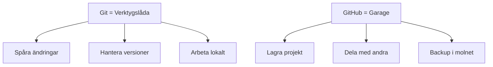
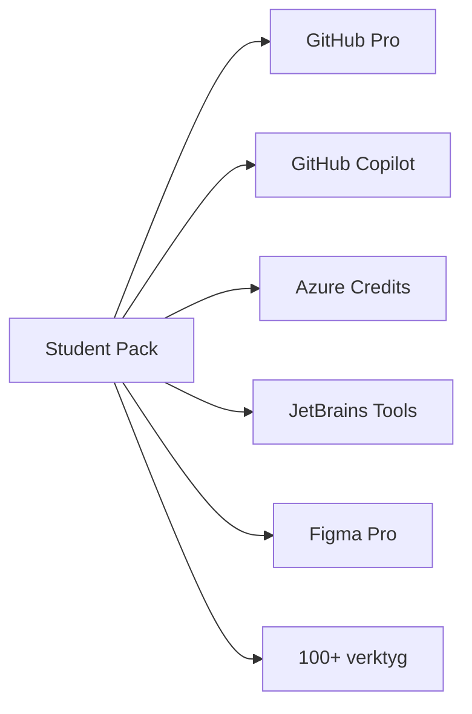

## **Git vs GitHub - Vad är skillnaden?** 🤔

### **Git = Verktyget** 🛠️

- **Program** som installeras på er dator
- **Versionshantering** - spårar ändringar i kod
- **Lokalt** - funkar utan internet
- **Skapare:** Linus Torvalds (Linux-grundaren)

### **GitHub = Molntjänsten** ☁️

- **Website** där ni lagrar Git-repositories
- **Social plattform** för utvecklare
- **Backup** och **samarbete** i molnet
- **Skapare:** Microsoft (köpte från GitHub Inc)

---

## **Enkel metafor** 🏠

<div class="mermaid">



</div>

**Git** = verktygslådan hemma
**GitHub** = garaget där ni visar upp era projekt! 🚗

---

## **Varför behöver vi GitHub?** 🎯

### **För studenter:**

- **Portfolio** - visa upp era projekt för framtida arbetsgivare 💼
- **Backup** - aldrig förlora kod igen! 🔒
- **Samarbete** - jobba i grupp på projekt 👥
- **Learning** - se andras kod och lär er 📚

### **Gratis student-benefits:**

- **GitHub Pro** gratis (unlimited privata repos)
- **GitHub Copilot** AI-kodassistans 🤖
- **Plus:** Figma, Azure, JetBrains, m.m. 💰

---

## **Student Benefits - Värde ~$200,000!** 💎

GitHub Student Pack inkluderar:



**Sammanlagt värde:** Hundratusentals kronor per år! 🤑

---

## **Registrera GitHub-konto** 📝

### **Steg 1-3: Grundregistrering**

1. **Gå till:** [github.com](https://github.com)
2. **Sign up** med er **skol-email** (viktigt!)
3. **Välj username** (tips: använd riktigt namn)

### **Steg 4-5: Verifiera**

4. **Kolla email** och klicka verifieringslänk
5. **Välj plan:** Free (räcker för börjar)

**Pro-tip:** Username blir er "developer brand" - välj klokt! 💡

---

## **Student Pack Aktivering** 🎓

### **Viktiga steg:**

1. **Gå till:** [education.github.com](https://education.github.com/pack)
2. **Klicka:** "Get student benefits"
3. **Logga in** med GitHub-konto
4. **Verifiera** student-status:
   - Ladda upp **studiebevis** eller
   - Använd **skol-email** (.se domän)

### **Väntetid:** 1-7 dagar för manual review 📅

---

## **GitHub Profile Optimization** ✨

### **Gör er profil professionell:**

```markdown
# Exempel GitHub Bio:

👨‍💻 C# Student @ Campus Mölndal
🌱 Learning: ASP.NET, Entity Framework
🎯 Goal: Full-stack developer
📫 Reach me: din.email@student.example.se
```

### **Andra tips:**

- **Profilbild** - professionell men vänlig 📸
- **Location** - Göteborg, Sweden 📍
- **Company** - Campus Mölndal (Student) 🏫

---

## **Första Repository** 📁

### **Skapa "Hello Campus Mölndal" repo:**

1. **Klicka:** "New repository" (grön knapp)
2. **Repository name:** `hello-campus-molndal`
3. **Description:** "My first C# project at Campus Mölndal"
4. **✅ Public** (för portfolio)
5. **✅ Add README**
6. **✅ Add .gitignore** → Visual Studio
7. **✅ Choose license** → MIT

---

## **README.md Template** 📄

````markdown
# Hello Campus Mölndal! 👋

## 🎯 Om projektet

Mitt första C# projekt på Campus Mölndal CMYH kursen.

## 🛠️ Tekniker

- C# .NET 6.0
- Console Application
- Visual Studio / Rider

## 🚀 Hur man kör

```bash
git clone https://github.com/[username]/hello-campus-molndal
cd hello-campus-molndal
dotnet run
```
````

## 📚 Vad jag lärde mig

- [x] Grundläggande C# syntax
- [x] Console.WriteLine()
- [x] Variabler och datatyper
- [ ] Loopar (kommande...)

## 👨‍💻 Skapare

**Ditt Namn** - C# Student @ Campus Mölndal

````

---

## **GitHub Desktop vs Git CLI** ⚖️

### **GitHub Desktop (GUI)** 🖱️
✅ Visuellt och intuitivt
✅ Perfekt för nybörjare
✅ Drag & drop funktioner
❌ Mindre kraftfullt

### **Git CLI (Terminal)** ⌨️
✅ Alla Git-funktioner
✅ Snabbare för proffs
✅ Funkar överallt
❌ Inlärningskurva

**Mitt råd:** Börja med Desktop, lär er CLI senare! 📈

---

## **GitHub i olika IDEs** 💻

### **Visual Studio:**
- Inbyggd Git/GitHub integration
- Clone repos direkt från Start Page
- Commit, push, pull från IDE

### **Rider:**
- VCS (Version Control) panel
- Git Graph för att se historik
- Merge conflicts UI

### **VS Code:**
- Source Control panel (Ctrl+Shift+G)
- GitLens extension för extra features
- Terminal för Git commands

---

## **Security Best Practices** 🔒

### **SSH Keys (rekommenderat):**
```bash
# Generera SSH key
ssh-keygen -t ed25519 -C "din.email@example.com"

# Lägg till i GitHub
# Settings → SSH and GPG keys → New SSH key
````

### **Personal Access Tokens:**

- Settings → Developer settings → Personal access tokens
- Använd istället för lösenord för Git operations

**Viktigt:** Aldrig committa lösenord eller API-nycklar! 🚨

---

## **GitHub Student Checklist** ✅

Efter denna lektion ska ni ha:

- [ ] GitHub-konto med skol-email
- [ ] Student Pack benefits aktiverade
- [ ] Professionell profil (bio, bild, location)
- [ ] Första repository skapat
- [ ] README.md med portfolio-fokus
- [ ] Förstått Git vs GitHub skillnaden
- [ ] Valt GitHub Desktop eller lärt er Git CLI basics

---

## **Nästa steg: Git Installation** ⏭️

Nu när GitHub är klart:

1. **Installera Git** på er lokala dator 💻
2. **Konfigurera** Git med GitHub-konto 🔧
3. **Lära Git workflow:** add → commit → push 🔄
4. **Klona** ert första projekt lokalt 📥

**Målet:** Seamless arbetsflöde mellan lokal kod och GitHub! 🚀

---

## **Källor & Resurser** 📚

**Bild på titelsidan:** Foto av Startup Stock Photos via Pexels - [Länk](https://images.pexels.com/photos/1181263/pexels-photo-1181263.jpeg)

**GitHub Student Pack:** [education.github.com](https://education.github.com/pack)

**GitHub Docs:** [docs.github.com](https://docs.github.com)

**Git Documentation:** [git-scm.com](https://git-scm.com/doc)
