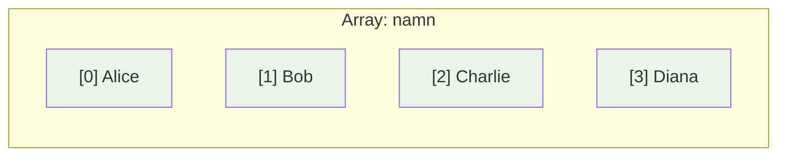
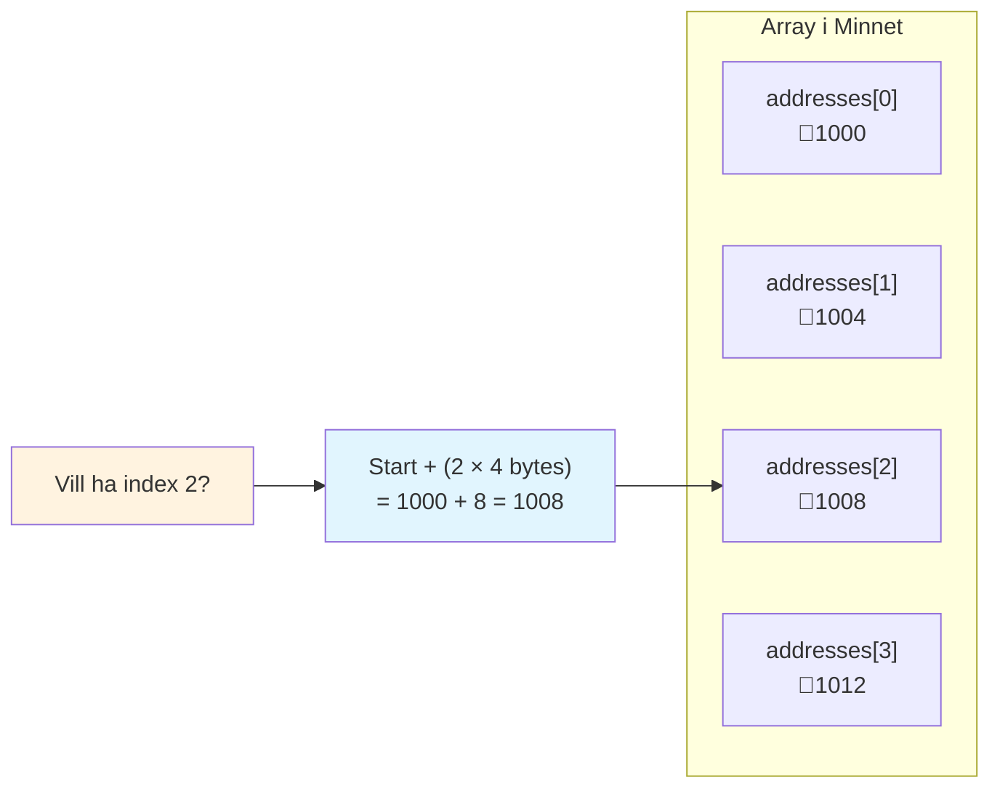

# Arrayer - Flera Värden, En Variabel

## Snabbguide (15 min föreläsning → kodtid!)

# Vad är en Array?

En array är som ett **parkeringshus** 🅿️ med numrerade platser



```csharp
string[] names = {"Alice", "Bob", "Charlie", "Diana"};
Console.WriteLine(names[0]); // Utskrift: Alice
Console.WriteLine(names[2]); // Utskrift: Charlie
```

**Viktigt:** Arrayer börjar räkna från **0**, inte 1!

# Minneslayout - Hur Arrayer Bor

```mermaid
graph TB
    subgraph "Stack"
        A[Variabel: numbers]
    end

    subgraph "Heap - Sammanhängande Minnesblock"
        B["[0] 10"]
        C["[1] 20"]
        D["[2] 30"]
        E["[3] 40"]
    end

    A --> B
    B  C
    C  D
    D  E

    style A fill:#e8f5e8
    style B fill:#fff0f0
    style C fill:#fff0f0
    style D fill:#fff0f0
    style E fill:#fff0f0
```

Arrayer lagrar element **bredvid varandra** i minnet = **supesnabb åtkomst**!

# Skapa Arrayer - 3 Sätt

**1. Skapa och fyll på en gång:**

```csharp
int[] scores = {85, 92, 78, 94};
string[] colors = {"röd", "blå", "grön"};
```

**2. Skapa tom, sedan fyll:**

```csharp
int[] numbers = new int[5];  // 5 tomma platser
numbers[0] = 10;             // Fyll första platsen
numbers[1] = 20;             // Fyll andra platsen
```

Du kan fortsätta fylla tills du når arrayens längd. Här kommer en sak som kan verka lite konstigt men arrayer har en fast storlek när de skapas. Du kan inte ändra storleken på en array efter att den har skapats. Om du försöker lägga till fler element än vad arrayen har plats för kommer du att få ett felmeddelande. Vad som är mer förvirrande är att första positionen i en array är alltid 0, inte 1. Så om du skapar en array med storlek 5 så har den platserna 0, 1, 2, 3 och 4. Om du försöker lägga till ett element på position 5 kommer du att få ett felmeddelande eftersom det inte finns någon sådan position i arrayen.

Varför detta?

Jo int[] numbers = new int[5]; skapar en array med 5 platser i minnet. Om vi säger att den lagras i minnesplats $C000 (_C64 fans kommer säker ihåg denna adress_). Då kommer plats 0 att vara på adress $C000, plats 1 på adress $C004 (eftersom en int tar 4 bytes), plats 2 på adress $C008, plats 3 på adress $C00C och plats 4 på adress $C010. Det finns ingen plats 5 eftersom arrayen bara har 5 platser, från 0 till 4.

| Minnesadress | Array-index | Värde |
| ------------ | :---------: | :---: |
| $C000–$C003  |      0      |  10   |
| $C004–$C007  |      1      |  20   |
| $C008–$C00B  |      2      |   0   |
| $C00C–$C00F  |      3      |   0   |
| $C010–$C013  |      4      |   0   |

Första platsen är alltså numbers position 0, andra platsen är position 1, tredje platsen är position 2, fjärde platsen är position 3 och femte platsen är position 4.

**3. Skapa med specifik storlek:**

```csharp
string[] students = new string[30];  // Plats för 30 studenter
```

# Viktiga Array-Operationer

```csharp
// Skapa array
int[] grades = {85, 90, 78, 92, 87};

// Hämta värden (LÄSA)
int firstGrade = grades[0];    // 85
int lastGrade = grades[4];     // 87

// Man kan också få sista elementet med Length
int lastGradeAlt = grades[grades.Length - 1]; // 87
// Längden av en array är alltid 1 mer än det sista indexet eftersom index börjar på 0. Detta kan dock vara lite farlig ifall arrayen är tom, då blir Length 0 och Length - 1 blir -1 vilket ger ett felmeddelande. Kolla alltid arrayens längd innan du gör detta.

// eller i modernare form sen C# 8.0
int lastGradeModern = grades[^1]; // 87
// Bästa lösningen

// Swiftie-not: 87 är för övrigt Travis Kelseys nummer i NFL.

// Ändra värden (SKRIVA)
grades[2] = 95;                // Ändra 78 till 95

// Array-storlek
int howMany = grades.Length;   // 5

// Loopa genom alla
for (int i = 0; i < grades.Length; i++)
{
    Console.WriteLine($"Betyg {i}: {grades[i]}");
}
```

# Arrayer + If-Satser = Kraft! 💪

```csharp
int[] testScores = {85, 92, 67, 78, 94, 58};

for (int i = 0; i < testScores.Length; i++)
{
    if (testScores[i] >= 90)
    {
        Console.WriteLine($"Student {i}: Utmärkt! ({testScores[i]})");
    }
    else if (testScores[i] >= 70)
    {
        Console.WriteLine($"Student {i}: Bra ({testScores[i]})");
    }
    else
    {
        Console.WriteLine($"Student {i}: Behöver hjälp ({testScores[i]})");
    }
}
```

**Här händer magin - arrayer + loopar + if-satser!**

# Vanliga Misstag att Undvika ⚠️

**1. Index utanför gränser:**

Aj aj aj... inte bra... lätt hänt...
```csharp
int[] numbers = {1, 2, 3};
Console.WriteLine(numbers[5]); // 💥 KRASCH! Bara 0,1,2 finns
```

**2. Glöm att arrayer börjar på 0:**

Rookie error som även erfarna gör ibland...
```csharp
// Hämta SISTA elementet
int[] scores = {10, 20, 30, 40};
int last = scores[scores.Length - 1]; // scores[3], INTE scores[4]
```

**3. Försöka ändra array-storlek:**

mwahahaaa nope!
```csharp
int[] numbers = {1, 2, 3};
// numbers.Length = 5; // 💥 Går inte! Storleken är fast
```

# Snabba Övningsexempel

**Vi kodar dessa tillsammans:**

1. **Hitta högsta poäng:**

```csharp
int[] scores = {78, 92, 85, 67, 94, 87};
// TODO: Hitta och skriv ut högsta poänget
// Hint 1: Använd en variabel för att spåra högsta poäng
// Hint 2: Loopa genom arrayen och jämför varje poäng med den högsta
// Hint 3: Påminn läraren om att köra denna Live :D
```

2. **Räkna hur många som klarade sig (>= 70):**

```csharp
int[] grades = {85, 45, 78, 92, 67, 58, 94};
// TODO: Räkna studenter som klarade sig
// Hint 1: Använd en räknare (int counter = 0;)
// Hint 2: Loopa genom arrayen och öka räknaren för varje god
// Hint 3: Påminn läraren om att köra denna Live ;)
```

3. **Dubbla alla nummer:**

```csharp
int[] values = {5, 10, 15, 20};
// TODO: Dubbla varje nummer i arrayen
// Hint 1: Loopa genom arrayen och multiplicera varje element med 2
// Hint 2: Skriv ut den uppdaterade arrayen
// Hint 3: Påminn läraren om att köra denna Live :P
```

# Minneseffektivitet - Varför Arrayer är Snabba



**Formel:** `array[index]` = `startadress + (index × elementstorlek)`

**Resultat:** Att hitta vilket element som helst tar samma tid = **O(1)**

# Sammanfattning - Arrayer på 2 Minuter

✅ **Arrayer** = numrerade parkeringsplatser för liknande data
✅ **Index börjar på 0** - kom ihåg detta!
✅ **Length-egenskap** berättar hur många element
✅ **Fast storlek** när den väl skapats
✅ **Supersnabb åtkomst** tack vare minneslayout
✅ **Perfekt med loopar och if-satser**

```csharp
// Array startpaket:
int[] numbers = {1, 2, 3, 4, 5};
for (int i = 0; i < numbers.Length; i++) {
    if (numbers[i] > 3) {
        Console.WriteLine($"Hittade stort nummer: {numbers[i]}");
    }
}
```

# Nu Ska Vi Koda! 🚀

**Ditt uppdrag (nästa 45 minuter):**

1. Skapa en array med dina favoritfilmer
2. Loopa igenom och skriv ut varje film
3. Lägg till if-satser för att markera "måste se" filmer
4. Hitta den längsta filmtiteln
5. Räkna filmer per årtionde

**Kom ihåg:** Arrayer + loopar + if-satser = programmeringssuperkrafter!
