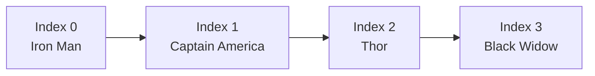

# 

# **Arrays**
### Avengers roster management för din kod

---

## **Varför ska vi ens bry oss om Arrays?**

Tänk dig att du är Nick Fury och behöver organisera Avengers-teamet.

Du kan inte bara ha Iron Man, Captain America och Thor som separata variabler!

Du behöver en **roster** - en ordnad lista där du kan hålla koll på alla hjältar, lägga till nya medlemmar och snabbt hitta rätt person för rätt uppdrag.

Det är **exakt** vad arrays gör för din kod!

---

## **Kärnan i Arrays**

Summan av kardemumman är egentligen ganska enkel:

- **Array**: Som en lång rad med fack där varje fack har en adress (index)
- **Index**: Börjar alltid på 0 (första hjälten är position 0)
- **Fixed Size**: När du skapat arrayen kan du inte ändra storleken

<div class="mermaid">



</div>

Hängde du med? Det är som att ha numrerade skåp i ett gym!

---

## **Grundläggande Array - Avengers Roster**

Hur ser det ut i koden då?

```csharp
// Skapa Avengers roster med 4 platser
string[] avengers = new string[4];

// Lägg till hjältar (indexering börjar på 0)
avengers[0] = "Iron Man";
avengers[1] = "Captain America";  
avengers[2] = "Thor";
avengers[3] = "Black Widow";

// Kalla in en specifik hjälte
Console.WriteLine($"Vi behöver {avengers[0]}!"); // Iron Man
```

Ser du? Vi har **fasta platser** och **tydliga adresser**. Precis som parkeringsplatser utanför Stark Tower!

---

## **Array Initialization - Direkt rekrytering**

Du kan också skapa hela teamet på en gång:

```csharp
// Direktrekrytering av Avengers
string[] avengers = { 
    "Iron Man", 
    "Captain America", 
    "Thor", 
    "Black Widow" 
};

// Eller så här
string[] guardians = new string[] { 
    "Star-Lord", 
    "Gamora", 
    "Rocket", 
    "Groot" 
};

Console.WriteLine($"Team size: {avengers.Length}"); // 4
```

Mycket effektivare än att rekrytera en och en!

---

## **Array Operations - Teamarbete**

```csharp
string[] heroes = { "Iron Man", "Thor", "Hulk", "Captain America" };

// Loopa genom hela teamet
foreach (string hero in heroes)
{
    Console.WriteLine($"{hero} is ready for action!");
}

// Hitta en specifik hjälte
for (int i = 0; i < heroes.Length; i++)
{
    if (heroes[i] == "Hulk")
    {
        Console.WriteLine($"Hulk found at position {i}");
        break;
    }
}
```

Nu kan vi **koordinera hela teamet** istället för att hantera varje hjälte separat!

---

## **Dags att kavla upp ärmarna!**

Nu har ni fått grunderna i arrays. Teori är bra, men att faktiskt "koda vilt" med arrays är tusen gånger bättre.

Ni kommer nu att jobba i par eller smågrupper med några övningar.

**Målet**: Inte bara att skapa arrays, utan att förstå när och varför man använder dem.

---

## **Dagens övningar**

### **Övning 1: RPG Party Management**
Här får ni skapa ett äventyrslag med olika karaktärer. Fokus på grundläggande array-operationer.

### **Övning 2: Inventory System**  
Nu bygger ni ett lagersystem för en butik. Arrays med produkter och priser.

### **Övning 3: Grade Calculator**
Hantera studentbetyg och beräkna genomsnitt. Praktisk tillämpning av arrays.

**Kom ihåg**: Det är helt okej att det blir fel. Det är då vi lär oss!

---

## **Snyggt jobbat!**

Kör hårt nu. Fråga mig om ni fastnar.

Arrays är eran nya superkraft för att organisera data som proffs.

**Ni klarar det här!** 🚀

---

## **Källor & Resurser**

Allt material är skapat för utbildningssyfte.

- **Bakgrundsbild**: Kod och tangentbord via Pexels  
- **Mermaid diagram**: Array index visualization
- **Kodexempel**: Avengers-themed educational examples

**Mer inspiration**:
- Microsoft Docs: Arrays in C#
- C# Array best practices