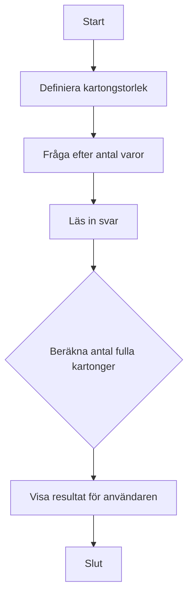

# 📦 Övning: Kartongräknaren

## Mål

Denna övning fokuserar på två viktiga matematiska operationer i programmering: **heltalsdivision** och **modulus** (rest). Du kommer att lära dig hur du kan räkna ut hur många gånger ett tal ryms i ett annat, och vad som blir över.

## Beskrivning

Ett lager ska packa varor i kartonger. Varje kartong rymmer ett visst antal varor (t.ex. 12 stycken). Du ska skapa ett program som frågar användaren hur många varor som ska packas och sedan räknar ut hur många fulla kartonger det blir.

## Krav

1.  Programmet ska ha en fast storlek på kartongerna (t.ex. 12 varor per kartong).
2.  Fråga användaren hur många varor som ska packas totalt.
3.  Använd heltalsdivision (`/`) för att räkna ut hur många *fulla* kartonger det blir.
4.  Presentera resultatet för användaren.
5.  All output till användaren ska vara på svenska.
6.  All kod (variabler, metoder etc.) ska vara på engelska.
7.  Koden ska vara kommenterad på svenska.

### Flödesdiagram



## Bonusutmaning

Använd modulus-operatorn (`%`) för att räkna ut hur många varor som blir **över** och inte fyller en hel kartong. Visa detta för användaren i slutet.

Exempel: Om det finns 27 varor och varje kartong rymmer 12, ska programmet visa:
*   Antal fulla kartonger: 2
*   Varor över: 3

## 🚀 Så kör du projektet

Skapa ett nytt console-projekt och följ kraven ovan.

<details>
<summary><strong>💡 </strong></summary>

```csharp
using System;

class Program
{
    static void Main(string[] args)
    {
        // --- Del 1: Konfiguration och välkomstmeddelande ---

        // Vi bestämmer hur många varor som ryms i en standardkartong.
        // 'const' används för värden som aldrig ska ändras.
        const int itemsPerBox = 12;

        Console.ForegroundColor = ConsoleColor.DarkYellow;
        Console.WriteLine("--- 📦 Kartongräknaren ---");
        Console.WriteLine($"Detta program räknar ut hur många kartonger som behövs. Varje kartong rymmer {itemsPerBox} varor.");
        Console.ResetColor();
        Console.WriteLine();

        // --- Del 2: Inmatning från användaren ---

        Console.Write("Ange totalt antal varor att packa: ");
        int totalItems = int.Parse(Console.ReadLine());

        // --- Del 3: Beräkning (Heltalsdivision) ---

        // När man dividerar två heltal (int) i C#, utförs en heltalsdivision.
        // Resultatet blir hur många gånger 'itemsPerBox' helt ryms i 'totalItems'.
        // Exempel: 27 / 12 = 2. Decimalerna kastas bort.
        int fullBoxes = totalItems / itemsPerBox;

        // --- Del 4: Presentation av resultat ---

        Console.ForegroundColor = ConsoleColor.Green;
        Console.WriteLine();
        Console.WriteLine($"Det blir {fullBoxes} fulla kartonger.");
        Console.ResetColor();

        // --- Bonusutmaning: Beräkna varor som blir över (Modulus) ---
        Console.ForegroundColor = ConsoleColor.Yellow;
        Console.WriteLine();
        Console.WriteLine("--- Bonus: Varor över ---");
        Console.ResetColor();

        // Modulus-operatorn (%) ger resten efter en heltalsdivision.
        // Exempel: 27 % 12 = 3. (27 - (12 * 2) = 3)
        int leftoverItems = totalItems % itemsPerBox;

        Console.ForegroundColor = ConsoleColor.Green;
        Console.WriteLine($"Det blir {leftoverItems} varor över.");
        Console.ResetColor();

        // Pausar programmet tills användaren trycker på en tangent.
        Console.WriteLine("\nTryck på valfri tangent för att avsluta...");
        Console.ReadKey();
    }
}
```

</details>
