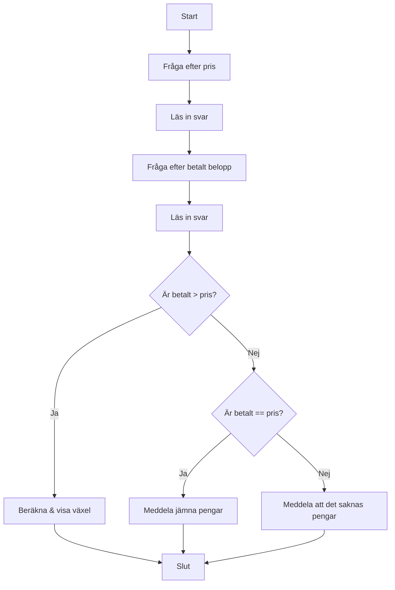

# 💰 Övning: Växelräknaren

## Mål

I den här övningen får du träna på att hantera pengar, använda subtraktion och framförallt använda `if-else`-satser för att hantera olika utfall, som till exempel om en kund betalar exakt rätt summa eller för lite.

## Beskrivning

Du ska bygga ett enkelt kassaprogram som räknar ut hur mycket växel en kund ska få tillbaka. Programmet frågar först vad varan kostar och sedan hur mycket kunden betalar.

## Krav

1.  Fråga användaren vad priset på varan är.
2.  Fråga användaren hur mycket pengar de betalar med.
3.  Beräkna skillnaden (växeln).
4.  Använd en `if-else`-struktur för att hantera tre olika fall:
    *   Om kunden betalat för lite: Meddela detta.
    *   Om kunden betalat exakt: Meddela att det var jämna pengar.
    *   Om kunden betalat för mycket: Meddela hur mycket växel de ska få tillbaka.
5.  All output till användaren ska vara på svenska.
6.  All kod (variabler, metoder etc.) ska vara på engelska.
7.  Koden ska vara kommenterad på svenska.

### Flödesdiagram



## Bonusutmaning

När du har fått grundprogrammet att fungera, bygg ut det så att det kan specificera växeln i olika sedlar och mynt (t.ex. 500-lappar, 100-lappar, 20-lappar, 5-kronor etc.). Detta är en klurig men mycket lärorik utmaning!

## 🚀 Så kör du projektet

Skapa ett nytt console-projekt och följ kraven ovan.

<details>
<summary><strong>💡 </strong></summary>

```csharp
using System;

class Program
{
    static void Main(string[] args)
    {
        // --- Del 1: Välkomstmeddelande ---
        Console.ForegroundColor = ConsoleColor.Yellow;
        Console.WriteLine("--- 💰 Växelräknaren ---");
        Console.WriteLine("Räkna ut kundens växel.");
        Console.ResetColor();
        Console.WriteLine();

        // --- Del 2: Inmatning ---
        Console.Write("Ange varans pris: ");
        int price = int.Parse(Console.ReadLine());

        Console.Write("Ange betalt belopp: ");
        int paidAmount = int.Parse(Console.ReadLine());

        // --- Del 3: Beräkning och villkor ---
        int change = paidAmount - price;

        Console.WriteLine(); // Tom rad för läsbarhet

        if (change > 0)
        {
            Console.ForegroundColor = ConsoleColor.Green;
            Console.WriteLine($"Kunden ska få tillbaka {change} kr i växel.");
            Console.ResetColor();
        }
        else if (change == 0)
        {
            Console.ForegroundColor = ConsoleColor.Blue;
            Console.WriteLine("Det var jämna pengar! Ingen växel behövs.");
            Console.ResetColor();
        }
        else // Om 'change' är mindre än 0
        {
            Console.ForegroundColor = ConsoleColor.Red;
            // Vi använder Math.Abs() för att visa ett positivt tal för hur mycket som saknas.
            Console.WriteLine($"Kunden har betalat för lite. Det saknas {Math.Abs(change)} kr.");
            Console.ResetColor();
        }

        // --- Bonus: Specificera växeln ---
        // Denna del körs bara om det finns växel att ge tillbaka.
        if (change > 0)
        {
            Console.ForegroundColor = ConsoleColor.Cyan;
            Console.WriteLine();
            Console.WriteLine("--- Bonus: Växelspecifikation ---");
            Console.ResetColor();

            Console.WriteLine("Växeln kan ges som:");

            int remainingChange = change;

            // Vi går från största till minsta valör.
            int fiveHundreds = remainingChange / 500;
            if (fiveHundreds > 0) Console.WriteLine($"- {fiveHundreds} st 500-lappar");
            remainingChange %= 500;

            int oneHundreds = remainingChange / 100;
            if (oneHundreds > 0) Console.WriteLine($"- {oneHundreds} st 100-lappar");
            remainingChange %= 100;

            int fifties = remainingChange / 50;
            if (fifties > 0) Console.WriteLine($"- {fifties} st 50-lappar");
            remainingChange %= 50;

            int twenties = remainingChange / 20;
            if (twenties > 0) Console.WriteLine($"- {twenties} st 20-lappar");
            remainingChange %= 20;

            int tens = remainingChange / 10;
            if (tens > 0) Console.WriteLine($"- {tens} st 10-kronor");
            remainingChange %= 10;

            int fives = remainingChange / 5;
            if (fives > 0) Console.WriteLine($"- {fives} st 5-kronor");
            remainingChange %= 5;

            if (remainingChange > 0) Console.WriteLine($"- {remainingChange} st 1-kronor");
        }

        // Pausar programmet.
        Console.WriteLine("\nTryck på valfri tangent för att avsluta...");
        Console.ReadKey();
    }
}
```

</details>
