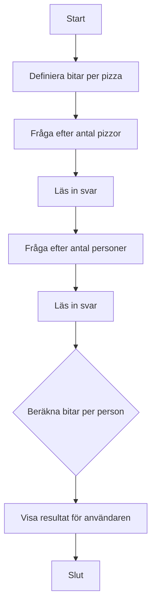

# 🍕 Övning: Pizza per Person

## Mål

I den här övningen får du arbeta med flyttal (decimaltal), division och `if`-satser för att fatta beslut baserat på ett beräknat resultat. Du kommer också att få se hur man kan avrunda tal.

## Beskrivning

Du ska skapa ett program som hjälper till att planera en pizzakväll. Programmet ska räkna ut hur många pizzabitar (slices) varje person får. Varje pizza är delad i ett visst antal bitar.

## Krav

1.  Programmet ska ha ett fast antal bitar per pizza (t.ex. 8).
2.  Fråga användaren hur många pizzor som har beställts.
3.  Fråga användaren hur många personer som ska äta.
4.  Beräkna det totala antalet pizzabitar.
5.  Beräkna hur många bitar varje person får (detta kan bli ett decimaltal).
6.  Presentera resultatet för användaren.
7.  All output till användaren ska vara på svenska.
8.  All kod (variabler, metoder etc.) ska vara på engelska.
9.  Koden ska vara kommenterad på svenska.

### Flödesdiagram



## Bonusutmaning

Lägg till en kontroll som meddelar användaren om det inte räcker med pizzor. Anta att varje person måste få **minst 3 bitar** för att bli mätt. Om det blir färre än 3 bitar per person, skriv ut ett meddelande om att de borde beställa fler pizzor.

## 🚀 Så kör du projektet

Skapa ett nytt console-projekt och följ kraven ovan.

<details>
<summary><strong>💡 </strong></summary>

```csharp
using System;

class Program
{
    static void Main(string[] args)
    {
        // --- Del 1: Konfiguration och välkomstmeddelande ---

        // En standardpizza har 8 bitar.
        const int slicesPerPizza = 8;

        Console.ForegroundColor = ConsoleColor.Red;
        Console.WriteLine("--- 🍕 Pizza per Person ---");
        Console.WriteLine($"Programmet räknar ut hur många bitar pizza var och en får.");
        Console.ResetColor();
        Console.WriteLine();

        // --- Del 2: Inmatning från användaren ---

        Console.Write("Hur många pizzor har ni beställt? ");
        int numberOfPizzas = int.Parse(Console.ReadLine());

        Console.Write("Hur många personer är ni? ");
        int numberOfPeople = int.Parse(Console.ReadLine());

        // --- Del 3: Beräkning ---

        // Beräknar det totala antalet pizzabitar.
        int totalSlices = numberOfPizzas * slicesPerPizza;

        // För att få ett decimaltal som resultat måste vi se till att minst en av
        // siffrorna i divisionen är ett decimaltal (double).
        // Vi konverterar 'totalSlices' till double innan divisionen.
        double slicesPerPerson = (double)totalSlices / numberOfPeople;

        // --- Del 4: Presentation av resultat ---

        Console.ForegroundColor = ConsoleColor.Green;
        Console.WriteLine();
        // Vi använder Math.Round för att avrunda till en decimal för en snyggare utskrift.
        Console.WriteLine($"Totalt finns det {totalSlices} bitar.");
        Console.WriteLine($"Varje person får {Math.Round(slicesPerPerson, 1)} bitar.");
        Console.ResetColor();

        // --- Bonusutmaning: Räcker pizzan? ---
        Console.ForegroundColor = ConsoleColor.Yellow;
        Console.WriteLine();
        Console.WriteLine("--- Bonus: Räcker pizzan? ---");
        Console.ResetColor();

        // Vi antar att alla behöver minst 3 bitar för att bli mätta.
        const int minSlicesPerPerson = 3;

        // En if-sats som kontrollerar om resultatet är under vår gräns.
        if (slicesPerPerson < minSlicesPerPerson)
        {
            Console.ForegroundColor = ConsoleColor.Red;
            Console.WriteLine($"OBS! Det är mindre än {minSlicesPerPerson} bitar per person. Ni borde nog beställa mer pizza!");
            Console.ResetColor();
        }
        else
        {
            Console.ForegroundColor = ConsoleColor.Green;
            Console.WriteLine("Det ser ut att räcka bra. Smaklig måltid!");
            Console.ResetColor();
        }

        // Pausar programmet.
        Console.WriteLine("\nTryck på valfri tangent för att avsluta...");
        Console.ReadKey();
    }
}
```

</details>
