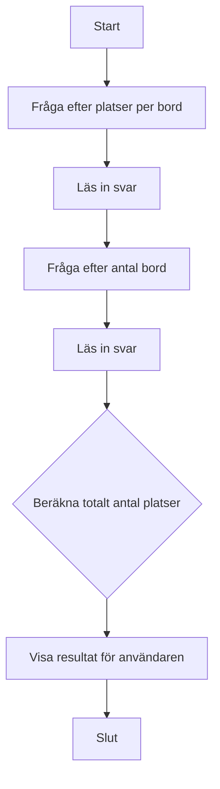

# 🪑 Övning: Platsräknaren

## Mål

Syftet med den här övningen är att träna på grundläggande C#-syntax, hantera inmatning från användaren, utföra en enkel beräkning och presentera ett resultat. Du kommer att jobba med variabler, datatyper och enkel matematik.

## Beskrivning

Du ska skapa ett konsolprogram som hjälper en restaurangägare att snabbt räkna ut det totala antalet sittplatser de har. Programmet ska fråga användaren hur många platser varje bord har och sedan hur många bord det finns totalt. Därefter ska det räkna ut och visa det totala antalet platser.

## Krav

1.  Programmet ska först fråga användaren hur många platser ett standardbord har.
2.  Programmet ska sedan fråga hur många bord som finns i lokalen.
3.  Programmet ska beräkna det totala antalet platser genom att multiplicera de två talen.
4.  Resultatet ska skrivas ut i konsolen i en tydlig och informativ mening.
5.  All output till användaren ska vara på svenska.
6.  All kod (variabler, metoder etc.) ska vara på engelska.
7.  Koden ska vara kommenterad på svenska för att förklara de olika delarna.

### Flödesdiagram



## Bonusutmaning

När du har fått grundprogrammet att fungera, lägg till följande funktionalitet:

*   Fråga användaren hur många av borden som är trasiga och inte kan användas.
*   Dra bort de trasiga borden från det totala antalet bord.
*   Beräkna och visa det nya, korrekta antalet tillgängliga sittplatser.

## 🚀 Så kör du projektet

Skapa ett nytt console-projekt och följ kraven ovan.

<details>
<summary><strong>💡 </strong></summary>

```csharp
// Inkluderar grundläggande systemfunktioner som behövs för konsolapplikationer.
using System;

// All kod i C# måste ligga inom en klass.
// Vår klass heter "Program" och är standard för konsolappar.
class Program
{
    // Main-metoden är startpunkten för vårt program.
    // Allt börjar här när programmet körs.
    static void Main(string[] args)
    {
        // Sätter färg på texten i konsolen för att göra det lite trevligare.
        Console.ForegroundColor = ConsoleColor.Cyan;

        // Skriver ut en välkomstrubrik.
        Console.WriteLine("--- 🪑 Platsräknaren ---");
        Console.WriteLine("Räkna ut det totala antalet sittplatser.");
        Console.ResetColor(); // Återställer färgen till standard.
        Console.WriteLine(); // Lägger till en tom rad för bättre läsbarhet.

        // --- Del 1: Inmatning från användaren ---

        // Frågar användaren hur många platser det finns per bord.
        // Vi använder "int.Parse" för att omvandla texten från användaren (string) till ett heltal (int).
        Console.Write("Ange antal platser per bord: ");
        int seatsPerTable = int.Parse(Console.ReadLine());

        // Frågar användaren hur många bord som finns totalt.
        Console.Write("Ange antal hela bord: ");
        int numberOfTables = int.Parse(Console.ReadLine());

        // --- Del 2: Beräkning ---

        // Enkel multiplikation för att räkna ut det totala antalet platser.
        // Detta är kärnlogiken i vårt program.
        int totalSeats = seatsPerTable * numberOfTables;

        // --- Del 3: Presentation av resultatet ---

        // Sätter färgen till grön för att visa ett positivt resultat.
        Console.ForegroundColor = ConsoleColor.Green;
        Console.WriteLine(); // Tom rad.

        // Skriver ut resultatet till användaren på ett tydligt sätt.
        // '$' framför strängen gör att vi kan infoga variabler direkt i texten med {}.
        Console.WriteLine($"Totalt finns det {totalSeats} sittplatser.");
        Console.ResetColor();
        Console.WriteLine();

        // --- Bonusutmaning: Hantera trasiga bord ---
        Console.ForegroundColor = ConsoleColor.Yellow;
        Console.WriteLine("--- Bonus: Trasiga bord ---");
        Console.ResetColor();

        Console.Write("Ange antal trasiga bord: ");
        int brokenTables = int.Parse(Console.ReadLine());

        // Beräknar antalet fungerande bord.
        int functionalTables = numberOfTables - brokenTables;

        // Beräknar platserna igen, men bara för de fungerande borden.
        int actualSeats = seatsPerTable * functionalTables;

        Console.ForegroundColor = ConsoleColor.Green;
        Console.WriteLine();
        Console.WriteLine($"När vi tar bort de trasiga borden finns det {actualSeats} platser kvar.");
        Console.ResetColor();

        // Pausar programmet och väntar på att användaren trycker på en tangent innan det stängs.
        // Detta förhindrar att konsolfönstret stängs direkt.
        Console.WriteLine("\nTryck på valfri tangent för att avsluta...");
        Console.ReadKey();
    }
}
```

</details>
