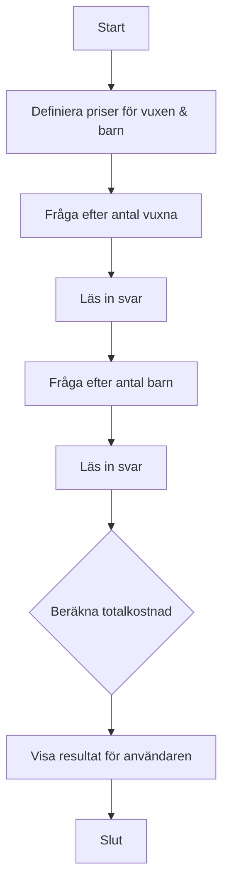

# 🎟️ Övning: Biljettkontrollen

## Mål

I den här övningen får du träna på att använda `if`-satser (villkor), hantera flera olika inmatningar från användaren och utföra beräkningar som baseras på olika förutsättningar. Detta är ett vanligt scenario i många program.

## Beskrivning

Du ska bygga ett program för en biografkassa. Programmet ska räkna ut den totala kostnaden för ett sällskap som består av vuxna och barn. Vuxna och barn har olika biljettpriser.

## Krav

1.  Programmet ska ha fasta priser för vuxna och barn (t.ex. vuxen: 120 kr, barn: 80 kr).
2.  Fråga användaren hur många vuxna som ingår i sällskapet.
3.  Fråga användaren hur många barn som ingår i sällskapet.
4.  Beräkna den totala kostnaden för alla vuxenbiljetter.
5.  Beräkna den totala kostnaden för alla barnbiljetter.
6.  Summera och presentera den totala kostnaden för hela sällskapet.
7.  All output till användaren ska vara på svenska.
8.  All kod (variabler, metoder etc.) ska vara på engelska.
9.  Koden ska vara kommenterad på svenska.

### Flödesdiagram



## Bonusutmaning

Utöka programmet så att det hanterar en specialregel: **barn under 5 år går in gratis**.

*   Efter att ha frågat om antalet barn, fråga hur många av dessa som är under 5 år.
*   Dra bort dessa "gratisbarn" från antalet betalande barn innan du beräknar den slutgiltiga kostnaden.
*   Visa tydligt i slutresultatet hur många gratisbiljetter som ingick.

## 🚀 Så kör du projektet

Skapa ett nytt console-projekt och följ kraven ovan.

<details>
<summary><strong>💡 </strong></summary>

```csharp
using System;

class Program
{
    // Main-metoden är där programmet startar.
    static void Main(string[] args)
    {
        // --- Del 1: Konfiguration och välkomstmeddelande ---

        // Här definierar vi våra biljettpriser som konstanter.
        // 'const' betyder att värdet inte kan ändras medan programmet körs.
        const int adultPrice = 120;
        const int childPrice = 80;

        Console.ForegroundColor = ConsoleColor.Magenta;
        Console.WriteLine("--- 🎟️ Biljettkontrollen ---");
        Console.WriteLine($"Välkommen! Vuxna kostar {adultPrice} kr och barn {childPrice} kr.");
        Console.ResetColor();
        Console.WriteLine();

        // --- Del 2: Inmatning från användaren ---

        Console.Write("Ange antal vuxna: ");
        int numberOfAdults = int.Parse(Console.ReadLine());

        Console.Write("Ange antal barn: ");
        int numberOfChildren = int.Parse(Console.ReadLine());

        // --- Del 3: Beräkning (Grundläggande) ---

        // Beräknar den totala kostnaden baserat på inmatningen.
        int totalCost = (numberOfAdults * adultPrice) + (numberOfChildren * childPrice);

        // --- Del 4: Presentation av grundresultat ---

        Console.ForegroundColor = ConsoleColor.Green;
        Console.WriteLine();
        Console.WriteLine($"Grundpris för {numberOfAdults} vuxna och {numberOfChildren} barn är: {totalCost} kr.");
        Console.ResetColor();
        Console.WriteLine();

        // --- Bonusutmaning: Hantera gratisbiljetter för små barn ---
        Console.ForegroundColor = ConsoleColor.Yellow;
        Console.WriteLine("--- Bonus: Gratis för barn under 5 år ---");
        Console.ResetColor();

        Console.Write("Hur många av barnen är under 5 år? ");
        int childrenUnderFive = int.Parse(Console.ReadLine());

        // Kollar om användaren angett ett rimligt antal.
        // Man kan inte ha fler barn under 5 än det totala antalet barn.
        if (childrenUnderFive > numberOfChildren)
        {
            Console.ForegroundColor = ConsoleColor.Red;
            Console.WriteLine("Felaktig inmatning! Antal barn under 5 kan inte vara fler än totala antalet barn.");
            Console.ResetColor();
        }
        else
        {
            // Räknar ut antalet barn som faktiskt ska betala.
            int payingChildren = numberOfChildren - childrenUnderFive;

            // Beräknar den nya, justerade totalkostnaden.
            int adjustedTotalCost = (numberOfAdults * adultPrice) + (payingChildren * childPrice);

            Console.ForegroundColor = ConsoleColor.Green;
            Console.WriteLine();
            Console.WriteLine($"Justerat pris för sällskapet ({childrenUnderFive} gratisbiljetter): {adjustedTotalCost} kr.");
            Console.ResetColor();
        }

        // Pausar programmet tills användaren trycker på en tangent.
        Console.WriteLine("\nTryck på valfri tangent för att avsluta...");
        Console.ReadKey();
    }
}
```

</details>
