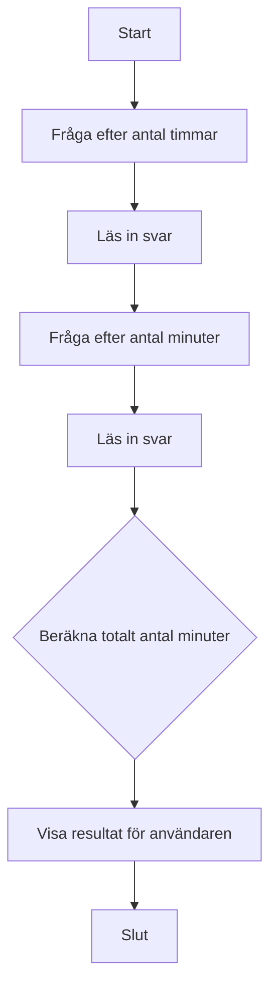

# ⏳ Övning: Tidsomvandlare

## Mål

I denna övning får du träna på att omvandla värden från en enhet till en annan. Detta är en vanlig uppgift som kräver att man förstår förhållandet mellan olika enheter och kan använda grundläggande matematik för att konvertera dem.

## Beskrivning

Du ska skapa ett program som kan omvandla en tidsangivelse i timmar och minuter till enbart minuter. Programmet ska fråga användaren efter antal timmar och antal minuter och sedan presentera den totala tiden i minuter.

## Krav

1.  Programmet ska veta att det går 60 minuter på en timme.
2.  Fråga användaren efter ett antal hela timmar.
3.  Fråga användaren efter ett antal minuter.
4.  Beräkna det totala antalet minuter.
5.  Presentera resultatet för användaren.
6.  All output till användaren ska vara på svenska.
7.  All kod (variabler, metoder etc.) ska vara på engelska.
8.  Koden ska vara kommenterad på svenska.

### Flödesdiagram



## Bonusutmaning

Bygg ut programmet så att det även kan göra den omvända operationen. Fråga användaren efter ett totalt antal minuter och låt programmet räkna ut och presentera hur många timmar och minuter det motsvarar. (Tips: heltalsdivision och modulus är dina vänner här!)

## 🚀 Så kör du projektet

Skapa ett nytt console-projekt och följ kraven ovan.

<details>
<summary><strong>💡 </strong></summary>

```csharp
using System;

class Program
{
    static void Main(string[] args)
    {
        // --- Del 1: Konfiguration och välkomstmeddelande ---

        // En konstant för hur många minuter det går på en timme.
        const int minutesPerHour = 60;

        Console.ForegroundColor = ConsoleColor.Blue;
        Console.WriteLine("--- ⏳ Tidsomvandlaren ---");
        Console.WriteLine("Omvandla timmar och minuter till enbart minuter.");
        Console.ResetColor();
        Console.WriteLine();

        // --- Del 2: Inmatning från användaren ---

        Console.Write("Ange antal timmar: ");
        int hours = int.Parse(Console.ReadLine());

        Console.Write("Ange antal minuter: ");
        int minutes = int.Parse(Console.ReadLine());

        // --- Del 3: Beräkning ---

        // Först omvandlas timmarna till minuter, sedan adderas de återstående minuterna.
        int totalMinutes = (hours * minutesPerHour) + minutes;

        // --- Del 4: Presentation av resultat ---

        Console.ForegroundColor = ConsoleColor.Green;
        Console.WriteLine();
        Console.WriteLine($"{hours} timmar och {minutes} minuter är totalt {totalMinutes} minuter.");
        Console.ResetColor();

        // --- Bonusutmaning: Omvandla tillbaka ---
        Console.ForegroundColor = ConsoleColor.Yellow;
        Console.WriteLine();
        Console.WriteLine("--- Bonus: Omvandla totala minuter tillbaka ---");
        Console.ResetColor();

        Console.Write("Ange ett totalt antal minuter att omvandla: ");
        int minutesToConvert = int.Parse(Console.ReadLine());

        // Heltalsdivision för att få antalet hela timmar.
        // Exempel: 145 / 60 = 2
        int convertedHours = minutesToConvert / minutesPerHour;

        // Modulus för att få minuterna som blir över.
        // Exempel: 145 % 60 = 25
        int convertedMinutes = minutesToConvert % minutesPerHour;

        Console.ForegroundColor = ConsoleColor.Green;
        Console.WriteLine();
        Console.WriteLine($"{minutesToConvert} minuter är detsamma som {convertedHours} timmar och {convertedMinutes} minuter.");
        Console.ResetColor();

        // Pausar programmet.
        Console.WriteLine("\nTryck på valfri tangent för att avsluta...");
        Console.ReadKey();
    }
}
```

</details>
