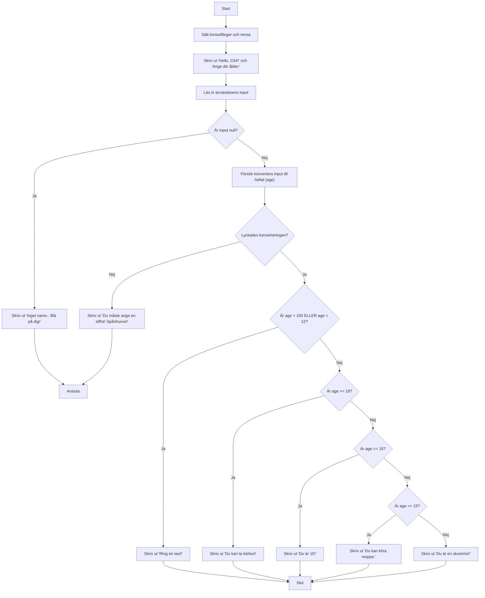

# Variaber och if-satser

Detta är ett C#-program som visar hur man använder variabler och if-satser

I detta fall blev det lite rörigt med inbäddade if-s och det är något man undviker i verkliga program för att slippa att koden blir för svår att läsa.

```csharp
// Namnet på programmet (namespace)
namespace If_else_live
{
    // Huvudklassen i programmet
    internal class Program
    {
    // Huvudmetoden där programmet startar
    static void Main(string[] args)
        {

            // Sätter bakgrundsfärgen i konsolfönstret till mörkblå
            Console.BackgroundColor = ConsoleColor.DarkBlue;
            // Sätter textfärgen till vit
            Console.ForegroundColor = ConsoleColor.White;
            // Rensar konsolfönstret
            Console.Clear();

            // Skriver ut en hälsning
            Console.WriteLine("Hello, C64!");
            // Skriver ut en tom rad
            Console.WriteLine();
            // Ber användaren att ange sin ålder
            Console.WriteLine("Ange din ålder:");

            // Skriver ut en prompt
            Console.Write("> ");
            // Läser in det användaren skriver (som en textsträng)
            string? name = Console.ReadLine();

            // Om användaren inte skrev något
            if (name==null)
            {
                // Meddelande om inget skrevs in
                Console.WriteLine("Inget namn.. Blä på dig!");
                // Avslutar programmet
                return;
            }

            // Skapar en variabel för ålder och sätter den till 0
            int age = 0;
            // Försöker konvertera det användaren skrev till ett heltal (ålder)
            bool isOK = int.TryParse(name, out age);

            // Om konverteringen lyckades
            if (isOK)
            {
                // Om åldern är större än 100 eller mindre än 12
                if (age>100 || age<12)
                {
                    // Skriv ut ett meddelande
                    Console.WriteLine("Ring en taxi!");
                }
                // Om åldern är 18 eller mer
                else if (age>=18)
                {
                    // Skriv ut att man kan ta körkort
                    Console.WriteLine("Du kan ta körkort");
                }
                // Om åldern är exakt 15
                else if (age==15)
                {
                    // Skriv ut att man är 15
                    Console.WriteLine("Du är 15!");
                }
                // Om åldern är 15 eller mer (men inte 18 eller mer)
                else if (age >= 15)
                {
                    // Skriv ut att man kan köra moppe
                    Console.WriteLine("Du kan köra moppe.");
                }
                // Om inget av ovanstående stämmer
                else
                {
                    // Skriv ut att man är en skummis
                    Console.WriteLine("Du är en skummis!");
                }


            }
            else // Om konverteringen misslyckades
            {
                // Meddelande om man inte skrev en siffra
                Console.WriteLine("Du måste ange en siffra! Spånhuvve!");
                // Avslutar programmet
                return;
            }


    }
    }
}
```

Här är ett diagram som visar hur programmet fungerar:



Den blev lite komplicerad, men det är OK vi kommer att göra mer sådan här kod längre fram och då göra det snyggare.
