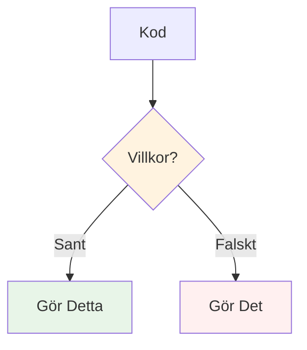
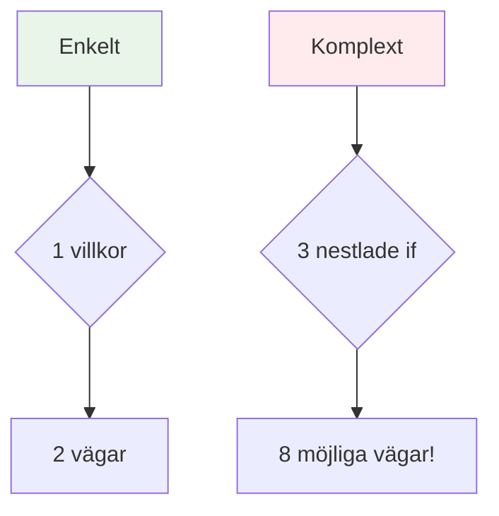

# If-Satser - Fatta Beslut
## Snabbguide (15 min föreläsning → kodtid!)

---

# If = Vägkorsning 🛤️



```csharp
if (age >= 18)
{
    Console.WriteLine("Du får rösta!");
}
else
{
    Console.WriteLine("Vänta några år!");
}
```

**Enkelt:** Kolla villkor → Välj väg → Kör kod

---

# Grundläggande If-Mönster

**1. Enkel If:**
```csharp
if (temperature > 25) 
{
    Console.WriteLine("Det är varmt! 🌞");
}
```

**2. If-Else:**
```csharp
if (score >= 70) 
{
    Console.WriteLine("Godkänd! ✅");
} 
else 
{
    Console.WriteLine("Försök igen! 📚");
}
```

**3. Flera villkor:**
```csharp
if (score >= 90)      Console.WriteLine("A - Utmärkt!");
else if (score >= 80) Console.WriteLine("B - Bra!");  
else if (score >= 70) Console.WriteLine("C - Godkänd!");
else                  Console.WriteLine("F - Underkänd!");
```

---

# Jämförelseoperatorer

| Symbol | Betydelse | Exempel |
|--------|-----------|---------|
| `==` | Lika med | `age == 18` |
| `!=` | Inte lika med | `name != "Alice"` |
| `>` | Större än | `score > 90` |
| `<` | Mindre än | `price < 100` |
| `>=` | Större eller lika | `grade >= 70` |
| `<=` | Mindre eller lika | `speed <= 50` |

```csharp
int score = 85;
if (score >= 70) 
{
    Console.WriteLine("Du klarade provet!");
}
```

---

# Logiska Operatorer - Kombinera Villkor

**OCH (&&) - Båda måste vara sanna:**
```csharp
if (age >= 18 && hasLicense) 
{
    Console.WriteLine("Du får köra bil!");
}
```

**ELLER (||) - En måste vara sann:**
```csharp
if (day == "Lördag" || day == "Söndag") 
{
    Console.WriteLine("Det är helg!");
}
```

**INTE (!) - Vänd sant/falskt:**
```csharp
if (!isRaining)  // Samma som: isRaining == false
{
    Console.WriteLine("Inget paraply behövs!");
}
```

---

# Akta Dig: Komplexitet Växer Snabbt! ⚠️



```csharp
// Enkelt ✅
if (age >= 18) { /* rösta */ }

// Komplext ⚠️ 
if (age >= 18) {
    if (hasID) {
        if (isRegistered) {
            /* rösta - men svårt att följa! */
        }
    }
}
```

**Regel:** Håll det enkelt eller använd hjälpmetoder!

---

# Snabba Lösningar för Komplexa If

**Istället för djup nestling:**
```csharp
if (user != null) {
    if (user.IsActive) {
        if (user.CanAccess) {
            DoSomething();
        }
    }
}
```

**Använd tidiga returner:**
```csharp
if (user == null) return;
if (!user.IsActive) return;
if (!user.CanAccess) return;
DoSomething();  // Mycket renare!
```

---

# Övningsutmaningar 

**Vi kodar dessa tillsammans:**

1. **Betygskalkylator:** Konvertera siffror till bokstavsbetyg
2. **Ålderskontroll:** Avgör om någon kan rösta, dricka, hyra bil
3. **Väderrådgivare:** Föreslå kläder baserat på temperatur & regn
4. **Lösenordsvalidator:** Kolla längd, specialtecken, osv.

**Mål:** Öva if-else mönster samtidigt som vi undviker komplexitetsfällor!

---

# Sammanfattning - If-Satser på 2 Minuter

✅ **If-satser** = beslutsfattande i kod  
✅ **Jämförelseoperatorer** (`==`, `>`, `<`, osv.) = kolla värden  
✅ **Logiska operatorer** (`&&`, `||`, `!`) = kombinera villkor  
✅ **Håll det enkelt** = lättare att debugga och underhålla  
✅ **Tidiga returner** = undvik djup nestling  

**Nu övar vi med riktiga kodexempel! 🚀**