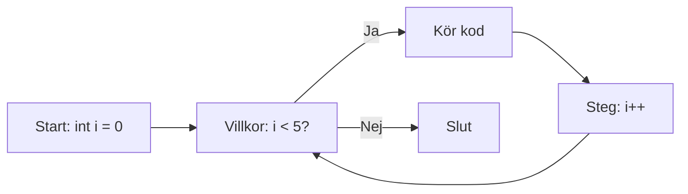
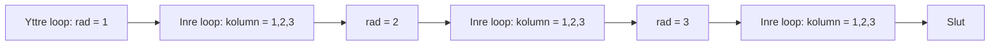

<!-- _class: lead -->
<!-- _backgroundImage: url('https://images.unsplash.com/photo-1571019613454-1cb2f99b2d8b?ixlib=rb-4.0.3&auto=format&fit=crop&w=1920&q=80') -->

# For-Loopar i C# 🔄

## En 15-minuters guide för nybörjare

_Campus Mölndal - CLO25_
_Objektorienterad Programmering_

---

## Vad är en For-Loop? 🤔

En **for-loop** är som att säga till datorn:

> "Gör det här 10 gånger!"

```csharp
for (int i = 0; i < 10; i++)
{
    Console.WriteLine($"Detta är gång nummer: {i}");
}
```

**Resultat:** Skriver ut 10 rader med text!

---

## Varför använder vi For-Loopar? 💡

**Utan loop:**

```csharp
Console.WriteLine("1");
Console.WriteLine("2");
Console.WriteLine("3");
Console.WriteLine("4");
Console.WriteLine("5");
// ... 995 rader till för att nå 1000!
```

**Med loop:**

```csharp
for (int i = 1; i <= 1000; i++)
{
    Console.WriteLine(i);
}
```

---

## For-Loop Anatomi 🔬

```csharp
for (start; villkor; steg)
{
    // Kod som körs varje gång
}
```

<div class="mermaid">



</div>

---

## Exempel 1: Räkna från 1 till 5 📊

<div >

```csharp
for (int i = 1; i <= 5; i++)
{
    Console.WriteLine($"Nummer: {i}");
}
```

**Output:**

```
Nummer: 1
Nummer: 2
Nummer: 3
Nummer: 4
Nummer: 5
```

---

## Exempel 2: Räkna bakåt 🔄

```csharp
for (int i = 10; i >= 1; i--)
{
    Console.WriteLine($"Nedräkning: {i}");
}
Console.WriteLine("🚀 Start!");
```

**Output:**

```
Nedräkning: 10
Nedräkning: 9
...
Nedräkning: 1
🚀 Start!
```

---

## Exempel 3: Hoppa i steg om 2 🦘

```csharp
for (int i = 0; i <= 10; i += 2)
{
    Console.WriteLine(i);
}
```

**Output:**

```
0
2
4
6
8
10
```

---

## For-Loop med Arrayer 📋

```csharp
string[] namn = {"Anna", "Bertil", "Cecilia"};

for (int i = 0; i < namn.Length; i++)
{
    Console.WriteLine($"Index {i}: {namn[i]}");
}
```

**Output:**

```
Index 0: Anna
Index 1: Bertil
Index 2: Cecilia
```

---

## Nästlade For-Loopar 🔄🔄

```csharp
for (int rad = 1; rad <= 3; rad++)
{
    for (int kolumn = 1; kolumn <= 3; kolumn++)
    {
        Console.Write($"[{rad},{kolumn}] ");
    }
    Console.WriteLine(); // Ny rad
}
```

**Output:**

```
[1,1] [1,2] [1,3]
[2,1] [2,2] [2,3]
[3,1] [3,2] [3,3]
```

---

<div class="mermaid">



</div>

---

## Vanliga Misstag ⚠️

### 1. Off-by-one error

```csharp
// FEL: Kör 11 gånger (0-10)
for (int i = 0; i <= 10; i++)

// RÄTT: Kör 10 gånger (0-9)
for (int i = 0; i < 10; i++)
```

### 2. Oändlig loop

```csharp
// FARLIGT: i ökar aldrig!
for (int i = 0; i < 10; /* glömt i++ */)
```

---

## Praktiska Användningsfall 🛠️

### 1. Summera tal

```csharp
int summa = 0;
for (int i = 1; i <= 100; i++)
{
    summa += i;
}
Console.WriteLine($"Summa 1-100: {summa}"); // 5050
```

---

### 2. Hitta största talet

```csharp
int[] tal = {5, 12, 8, 23, 15};
int störst = tal[0];

for (int i = 1; i < tal.Length; i++)
{
    if (tal[i] > störst)
        störst = tal[i];
}
```

---

## Break och Continue 🛑

### Break - Avsluta loopen

```csharp
for (int i = 1; i <= 10; i++)
{
    if (i == 5)
        break; // Stoppa här!
    Console.WriteLine(i); // Skriver 1,2,3,4
}
```

---

### Continue - Hoppa över

```csharp
for (int i = 1; i <= 5; i++)
{
    if (i == 3)
        continue; // Hoppa över 3
    Console.WriteLine(i); // Skriver 1,2,4,5
}
```

---

## For vs Foreach vs While 🤷‍♂️

### For - När du vet antal gånger

```csharp
for (int i = 0; i < 10; i++) { }
```

### Foreach - För arrayer/listor

```csharp
foreach (string item in lista) { }
```

### While - När du inte vet antal gånger

```csharp
while (villkor) { }
```

---

## Övningar för dig! 🎯

### Övning 1: Multiplikationstabell

Skriv en for-loop som skriver ut multiplikationstabellen för 7.

### Övning 2: Jämna tal

Skriv ut alla jämna tal mellan 1 och 20.

### Övning 3: Stjärnmönster

Skapa denna pattern med nästlade loopar:

```
*
**
***
****
*****
```

---

## Sammanfattning 📝

✅ **For-loopar** repeterar kod ett bestämt antal gånger
✅ **Struktur:** `for(start; villkor; steg)`
✅ **Användning:** Räkna, iterera genom arrayer, mönster
✅ **Nästlade loopar** för 2D-struktur
✅ **Break/Continue** för kontroll
✅ **Vanliga misstag:** Off-by-one, oändliga loopar

---

<!-- _class: lead -->

<!-- _backgroundColor: #f9f9f9 -->

# Frågor? 🙋‍♂️

**Kom ihåg:**
Övning ger färdighet!

Koda, Koda, Koda, Koda, testa,Koda, Koda, Koda, experimenteraKoda, Koda, Koda! 💻

---

## Nästa steg 🚀

1. **Öva** med enkla for-loopar
2. **Experimentera** med olika start/steg-värden
3. **Kombinera** med if-satser
4. **Utforska** nästlade loopar
5. **Bygg** små program som använder loopar

**Koda vilt!** 🎉
