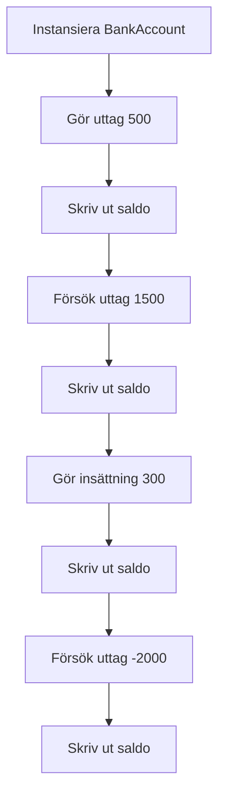
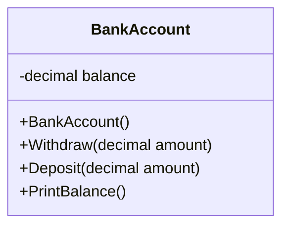
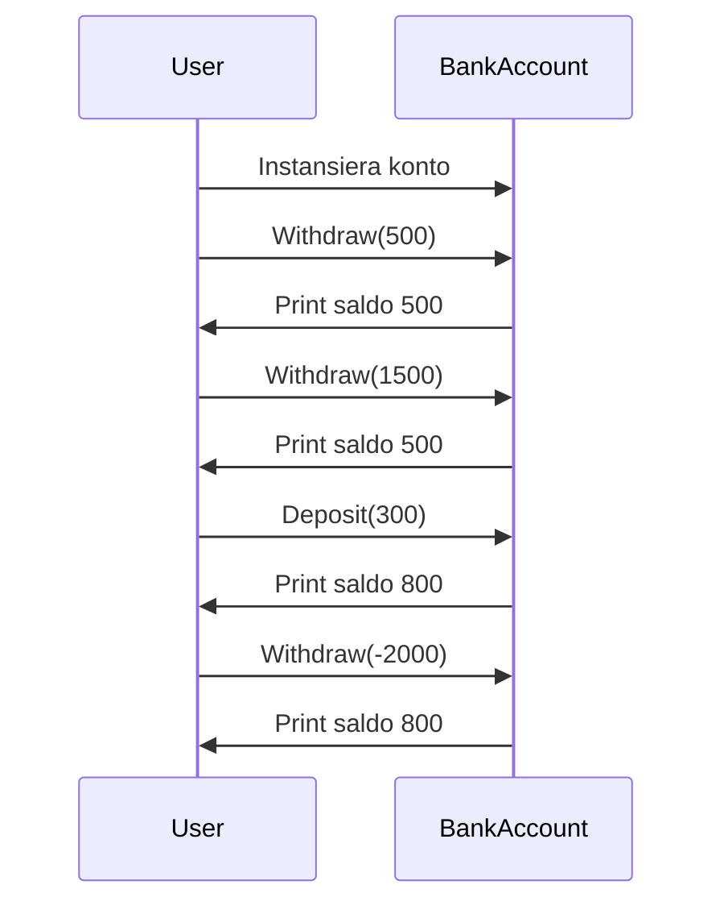

# Uppgift: Bankkonto-simulering

Skapa en klass som representerar ett bankkonto. Bankkontot ska starta med ett saldo på 1000:- när klassen instansieras. Programmet ska sedan göra flera uttag och insättningar, samt skriva ut saldot efter varje transaktion. Implementera följande steg:

1. Gör ett uttag på 500 kronor och skriv ut saldot.
2. Försök göra ett uttag på 1500 kronor, och skriv ut saldot. Hantera detta fall om det inte finns tillräckligt med pengar.
3. Gör en insättning på 300 kronor och skriv ut saldot.
4. Försök göra ett uttag på -2000 kronor, hantera detta på ett korrekt sätt, och skriv ut saldot.

<details>
<summary>English version</summary>
Create a class representing a bank account. The bank account should start with a balance of 1000 SEK when the class is instantiated. The program should then make several withdrawals and deposits, printing the balance after each transaction. Implement the following steps:

1. Make a withdrawal of 500 SEK and print the balance.
2. Attempt to withdraw 1500 SEK, and print the balance. Handle the case where there are insufficient funds.
3. Make a deposit of 300 SEK and print the balance.
4. Attempt to withdraw -2000 SEK, handle this case appropriately, and print the balance.
</details>

**Förväntad output**

```text
Saldo: 500:-
Saldo: 500:- (Försök till uttag på 1500 misslyckades, otillräckligt saldo.)
Saldo: 800:-
Saldo: 800:- (Ogiltigt uttag på -2000, inget uttag utfört.)
```

<details><summary>Exempelkod</summary>
**Startpunkt**
Inkludera ett kodskelett som visar de nödvändiga klasserna och metoderna som behövs för att lösa uppgiften. De ska endast innehålla kommentaren `// your code here`, så att studenten kan fylla i sin egen lösning.

```csharp
public class BankAccount
{
    private decimal balance;

    public BankAccount()
    {
        balance = 1000;
    }

    public void Withdraw(decimal amount)
    {
        // your code here
    }

    public void Deposit(decimal amount)
    {
        // your code here
    }

    public void PrintBalance()
    {
        // your code here
    }
}

public class Program
{
    public static void Main(string[] args)
    {
        BankAccount account = new BankAccount();

        // Make transactions
        account.Withdraw(500);
        account.PrintBalance();

        account.Withdraw(1500);
        account.PrintBalance();

        account.Deposit(300);
        account.PrintBalance();

        account.Withdraw(-2000);
        account.PrintBalance();
    }
}
```

</details>

<details><summary>Flödesschema</summary>
**Flödesschema**



</details>

<details><summary>Klassdiagram</summary>
**Klassdiagram**



</details>

<details><summary>Sekvensdiagram</summary>
**Sekvensdiagram**



</details>

<details>
<summary>Tips på planering</summary>
Planera din lösning genom att tänka på följande:

1. Skapa en konstruktor för klassen som sätter startvärdet för saldot.
2. Implementera metoden `Withdraw` för att hantera både vanliga uttag och försök till uttag som överstiger saldot.
3. Implementera metoden `Deposit` för att lägga till pengar på kontot.
4. Implementera metoden `PrintBalance` för att skriva ut det aktuella saldot efter varje transaktion.
5. Kom ihåg att hantera ogiltiga insättningar och uttag (t.ex. negativa värden).

**Förslag till backlog**
1. Skapa klassen `BankAccount`.
2. Implementera konstruktor som sätter startbeloppet till 1000.
3. Implementera metoden `Withdraw`.
4. Implementera metoden `Deposit`.
5. Implementera metoden `PrintBalance`.
6. Lägg till kontroller för negativa insättningar och uttag.
</details>

<details>
<summary>Tips på klasser som används</summary>
- `decimal` används för att representera pengar.
- Du behöver inte använda några externa bibliotek, men kom ihåg att använda datatyper och kontroller för att säkerställa att uttag inte överstiger saldot och att insättningar och uttag är giltiga belopp.
</details>

<details>
<summary>Pseudokod</summary>

```
START
    Skapa bankkonto med saldo 1000
    Gör ett uttag på 500
    Om tillräckligt saldo finns, minska saldot
    Annars, visa felmeddelande
    Skriv ut saldo
    Försök göra ett uttag på 1500
    Om tillräckligt saldo finns, minska saldot
    Annars, visa felmeddelande
    Skriv ut saldo
    Gör en insättning på 300
    Skriv ut saldo
    Försök göra ett uttag på -2000
    Om beloppet är negativt, visa felmeddelande
    Skriv ut saldo
SLUT
```

</details>

<details>
<summary>Förslag till lösning</summary>

```csharp
// BankAccount-klassen representerar ett bankkonto där vi kan göra insättningar, uttag och se saldot
public class BankAccount
{
    // En privat variabel som håller reda på hur mycket pengar som finns på kontot
    private decimal balance;

    // Konstruktor som körs när vi skapar ett nytt BankAccount
    public BankAccount()
    {
        // Tilldelar kontot ett startbelopp på 1000 när det skapas
        balance = 1000;
    }

    // Metoden Withdraw används för att ta ut pengar från kontot
    public void Withdraw(decimal amount)
    {
        // Kolla om uttagsbeloppet är mindre än eller lika med 0
        if (amount <= 0)
        {
            // Om beloppet är 0 eller negativt, ge ett meddelande om att uttaget är ogiltigt
            Console.WriteLine("Ogiltigt uttag, beloppet måste vara större än 0.");
        }
        // Kolla om beloppet som ska tas ut är mer än vad vi har på kontot
        else if (amount > balance)
        {
            // Om vi försöker ta ut mer pengar än vi har, ge ett felmeddelande om att det inte går
            Console.WriteLine("Otillräckligt saldo, uttag misslyckades.");
        }
        else
        {
            // Om beloppet är giltigt, minska saldot med det belopp vi tar ut
            balance -= amount;
            // Bekräfta för användaren att uttaget lyckades
            Console.WriteLine($"Uttag av {amount} lyckades.");
        }
    }

    // Metoden Deposit används för att sätta in pengar på kontot
    public void Deposit(decimal amount)
    {
        // Kolla om insättningsbeloppet är mindre än eller lika med 0
        if (amount <= 0)
        {
            // Om beloppet är 0 eller negativt, ge ett meddelande om att insättningen är ogiltig
            Console.WriteLine("Ogiltig insättning, beloppet måste vara större än 0.");
        }
        else
        {
            // Om beloppet är giltigt, lägg till beloppet på kontots saldo
            balance += amount;
            // Bekräfta för användaren att insättningen lyckades
            Console.WriteLine($"Insättning av {amount} lyckades.");
        }
    }

    // Metoden PrintBalance används för att visa hur mycket pengar som finns på kontot just nu
    public void PrintBalance()
    {
        // Skriv ut det aktuella saldot på kontot som hämtats från balance-variabeln
        Console.WriteLine($"Saldo: {balance}:-");
    }
}
```

</details>

Kom ihåg att förslaget är bara en av många möjliga lösningar. Det viktigaste är att du förstår problemet och kan skapa en fungerande lösning. Lycka till! 🚀

## Reflektionsfrågor

1. Varför använder vi `decimal` istället för `double` för pengar?
2. Hur kan vi förbättra felhanteringen i vår BankAccount-klass?
3. Vilka fler metoder skulle vara användbara för en riktig bankkonto-klass?
4. Hur skulle du implementera en transaktionshistorik?
5. Vad händer om två personer försöker göra uttag samtidigt från samma konto?
