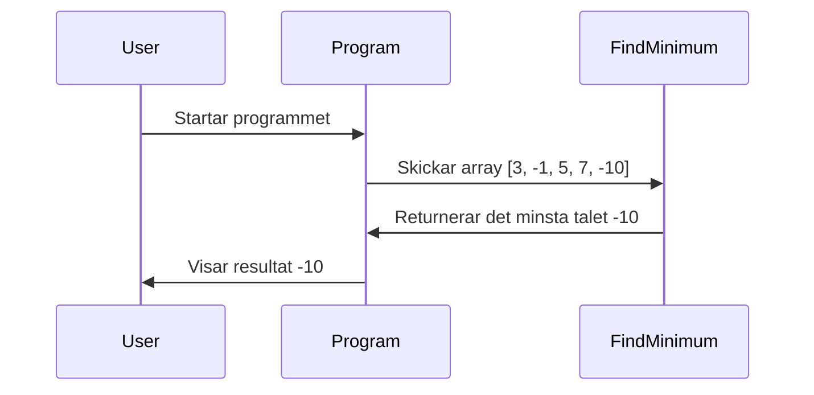

# Hitta det minsta talet i en array

**Intro:**
Nu ska vi titta på ett annat klassiskt problem – att hitta det minsta talet i en lista med heltal. Lätt, eller hur? Men hur gör vi detta på ett sätt som är både effektivt och lätt att förstå? Låt oss resonera lite kring det och bygga en lösning tillsammans.

**Förväntad output:**
```text
Anta att vi skickar in [3, -1, 5, 7, -10], då borde vi få tillbaka -10 eftersom det är det minsta talet i listan.
```

**Sekvensdiagram:**


<details>
  <summary>Tips på hur man tänker</summary>

  Okej, jag har en lista med tal, och jag vill veta vilket som är det minsta. Hur gör jag bäst för att hitta det? Kanske jag ska börja med att anta att det första talet är det minsta och sedan gå igenom resten av listan och jämföra varje tal med det jag har antagit. Om jag hittar ett tal som är mindre än mitt "nuvarande minsta", byter jag ut det. På så sätt kan jag hålla reda på det minsta talet medan jag loopar genom listan.

  Eller ska jag försöka med någon annan strategi? Nej, att bara jämföra alla tal känns som det mest direkta sättet att lösa problemet. Låt oss göra det!
</details>

<details>
  <summary>Pseudokod</summary>

  ```
  Starta en metod som tar in en array av heltal.
  Anta att det första talet är det minsta.
  Loopa genom arrayen.
    Om du hittar ett tal som är mindre än det nuvarande minsta, uppdatera det minsta.
  Returnera det minsta talet.
  ```
</details>

<details>
  <summary>Förslag på lösning</summary>

**Kodexempel:**

```csharp
using System;

class Program
{
    static void Main()
    {
        int[] numbers = { 3, -1, 5, 7, -10 };  // Vår test-array
        int result = FindMinimum(numbers);
        Console.WriteLine(result);  // Förväntat output: -10
    }

    // Denna metod hittar det minsta talet i en array.
    static int FindMinimum(int[] numbers)
    {
        int min = numbers[0];  // Anta att det första talet är det minsta.

        // Loopa genom varje tal i arrayen.
        foreach (int number in numbers)
        {
            if (number < min)  // Om talet är mindre än det nuvarande minsta...
            {
                min = number;  // Uppdatera det minsta.
            }
        }

        return min;  // Returnera det minsta talet.
    }
}
```

</details>

Så här resonerar vi: om vi skickar in en array som `[3, -1, 5, 7, -10]`, borde vi få tillbaka -10. Denna metod jämför varje tal i arrayen och hittar det minsta på ett enkelt och effektivt sätt.

## Reflektionsfrågor

1. Vad händer om arrayen är tom? Hur kan vi hantera detta scenario?
2. Finns det något problem med att starta med `numbers[0]` som minimum?
3. Hur skulle du modifiera koden för att också returnera indexet för det minsta talet?
4. Vilken tidskomplexitet har denna algoritm? Kan den förbättras?
5. Hur skulle du implementera samma funktionalitet med LINQ's `Min()` metod?
