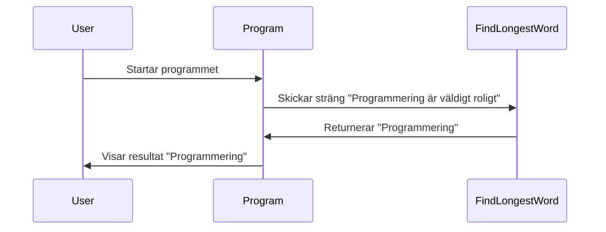
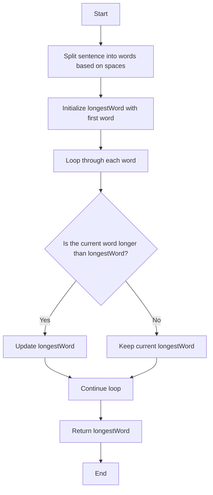

# Hitta det längsta ordet i en mening

**Intro:**
Här kommer en uppgift med strängar. Vi ska skriva en metod som tar in en mening och returnerar det längsta ordet. Som alltid finns det flera sätt att lösa det här problemet på, men vi ska resonera oss fram till den enklaste lösningen.

**Förväntad output:**

```text
Anta att vi skickar in "Programmering är väldigt roligt", då borde vi få tillbaka "Programmering" eftersom det är det längsta ordet.
```

**Sekvensdiagram:**



<details>
  <summary>Tips på hur man tänker</summary>

Okej, jag har en mening med flera ord och jag vill veta vilket som är det längsta. Hur gör jag bäst för att hitta det? Först måste jag dela upp strängen i enskilda ord, eller hur? Okej, så jag kan använda mig av något som skiljer på orden, typ mellanslag, för att dela upp strängen i mindre bitar. Sen jämför jag längden på varje ord och håller koll på det längsta ordet jag har sett hittills. Kanske enklaste lösningen är att bara loopa genom orden och uppdatera om jag hittar ett längre ord.



Det känns som ett bra tillvägagångssätt!

</details>

<details>
  <summary>Pseudokod</summary>

```
Starta en metod som tar in en sträng.
Dela upp strängen i ord baserat på mellanslag.
Skapa en variabel för att hålla det längsta ordet.
Loopa genom varje ord och jämför längden med det längsta hittills.
Uppdatera om du hittar ett längre ord.
Returnera det längsta ordet.
```

</details>

<details>
<summary>Förslag på lösning</summary>

**Kodexempel:**

```csharp
using System;

class Program
{
    static void Main()
    {
        string sentence = "Programmering är väldigt roligt";  // Vår test-sträng
        string longestWord = FindLongestWord(sentence);
        Console.WriteLine(longestWord);  // Förväntat output: "Programmering"
    }

    // Metod som hittar det längsta ordet i en sträng.
    static string FindLongestWord(string sentence)
    {
        string[] words = sentence.Split(' ');  // Dela upp meningen i ord.
        string longestWord = words[0];  // Anta att första ordet är det längsta.

        // Loopa genom varje ord.
        foreach (string word in words)
        {
            if (word.Length > longestWord.Length)  // Om ordet är längre än nuvarande längsta...
            {
                longestWord = word;  // Uppdatera det längsta ordet.
            }
        }

        return longestWord;  // Returnera det längsta ordet.
    }
}
```

Här resonerar vi så här: om vi skickar in meningen "Programmering är väldigt roligt", borde vi få tillbaka "Programmering" eftersom det är det längsta ordet. Genom att dela upp strängen i ord och sedan jämföra längderna hittar vi enkelt rätt svar.

</details>

## Reflektionsfrågor

1. Vad händer om det finns flera ord med samma längd? Vilket ord returneras då?
2. Hur skulle du modifiera koden för att hantera skiljetecken (komma, punkt, etc.)?
3. Vad händer om strängen är tom eller null?
4. Hur skulle du ändra metoden för att returnera alla ord med maximal längd?
5. Vilka andra sätt finns det att dela upp en sträng än `Split(' ')`?
