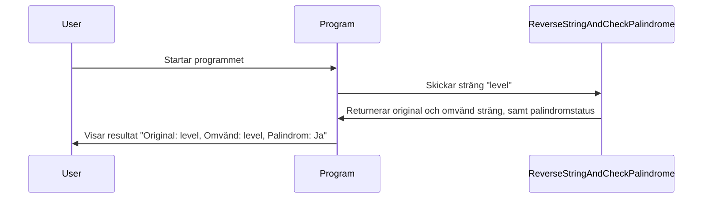
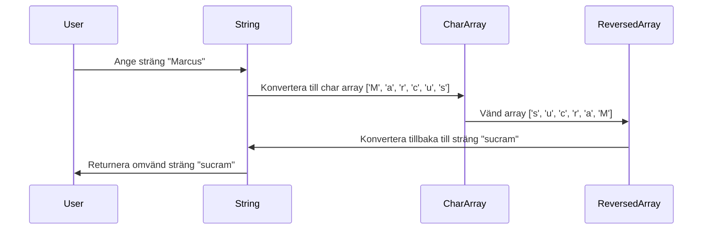
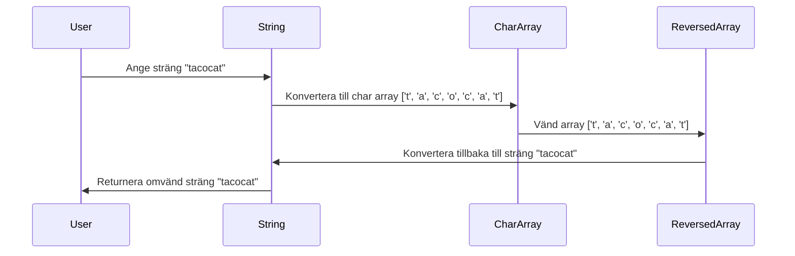

# Vänd på en sträng och kolla om det är en palindrom (med en loop)

**Intro:**
Vi ska skriva en metod som tar en sträng, vänder den genom att loopa över den, och slutligen kollar om strängen är en palindrom. Men vi ska göra det "manuellt", utan att använda inbyggda genvägar som `Reverse` – åtminstone till att börja med!

**Förväntad output:**

```text
Anta att vi skickar in "level", då borde vi få tillbaka:
Original sträng: level
Omvänd sträng: level
Är det en palindrom? Ja
```

```text
Anta att vi skickar in "hello", då borde vi få tillbaka:
Original sträng: hello
Omvänd sträng: olleh
Är det en palindrom? Nej
```

```text
Anta att vi skickar in "tacocat", då borde vi få tillbaka:
Original sträng: tacocat
Omvänd sträng: tacocat
Är det en palindrom? Ja
```

**Sekvensdiagram:**



<details>
  <summary>Tips på hur man tänker</summary>

  Okej, jag har en sträng och jag vill vända den genom att loopa igenom den. Hur gör jag bäst för att vända varje tecken? Kanske jag kan börja med att skapa en ny tom sträng och sedan lägga till varje tecken från den ursprungliga strängen i omvänd ordning, ett tecken i taget.

  Hmm... eller ska jag bara använda `Reverse`? Nej, inte nu! Vi kör manuellt för att förstå hur det funkar först, så kanske jag använder det där fusket senare.
</details>

<details>
  <summary>Pseudokod</summary>

```
Starta en metod som tar in en sträng.
Skapa en tom sträng för den omvända versionen.
Loop genom strängen baklänges och lägg till varje tecken till den nya strängen.
Skriv ut både originalsträngen och den omvända strängen.
Om den omvända strängen är samma som originalsträngen, är det en palindrom.
Skriv ut om det är en palindrom.
```

</details>

<details>
  <summary>Förslag på lösning</summary>

```csharp
using System;

class Program
{
    static void Main()
    {
        string input = "level";  // Vår test-sträng
        ReverseStringAndCheckPalindrome(input);
    }

    // Metod som vänder en sträng och kontrollerar om det är en palindrom.
    static void ReverseStringAndCheckPalindrome(string str)
    {
        string reversedStr = "";  // Tom sträng för den omvända strängen.

        // Loopar baklänges genom strängen.
        for (int i = str.Length - 1; i >= 0; i--)
        {
            reversedStr += str[i];  // Lägg till varje tecken i omvänd ordning.
        }

        // Skriv ut original och omvänd sträng.
        Console.WriteLine("Original sträng: " + str);
        Console.WriteLine("Omvänd sträng: " + reversedStr);

        // Kontrollera om det är en palindrom.
        if (str.Equals(reversedStr, StringComparison.OrdinalIgnoreCase))
        {
            Console.WriteLine("Är det en palindrom? Ja");
        }
        else
        {
            Console.WriteLine("Är det en palindrom? Nej");
        }

        // Busigt tips i slutet:
        Console.WriteLine("\n(Visste du att du också kan göra detta med Array.Reverse()? Men det här sättet är ju roligare!)");
    }
}
```

</details>

Här vänder vi på strängen manuellt genom att loopa baklänges, och till slut kollar vi om strängen är en palindrom.

<details><summary>Bonus: Alternativ lösning med Reverse</summary>
Och som bonus kan jag berätta att man faktiskt kunde ha använt `Reverse` – men var är det roliga i det? 😉

```csharp
string word = "tacocat";
string reverse = new string(word.Reverse().ToArray());
Console.WriteLine(word);
Console.WriteLine(reverse);
```

Metoden Reverse fungerar bara på arrays, så vi måste först konvertera strängen till en array av chars, sedan vända på det och slutligen göra om char arrayen till en sträng... *pust* 😓🫣 vilket kludd!!!



eller som i detta fall, så hade vi ordet "**tacocat**"


Vilket blir likadant LOL 😂

</details>

## Reflektionsfrågor

1. Varför är det bra att implementera palindrom-kontroll manuellt istället för att använda `Reverse()`?
2. Hur skulle du hantera stora och små bokstäver vid palindrom-kontroll?
3. Vad händer med mellanslag och skiljetecken i palindromer som "A man a plan a canal Panama"?
4. Hur skulle du optimera denna algoritm för mycket långa strängar?
5. Kan du implementera palindrom-kontroll utan att skapa en omvänd sträng?
