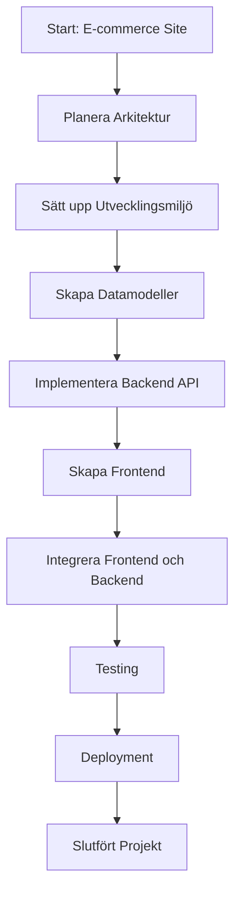
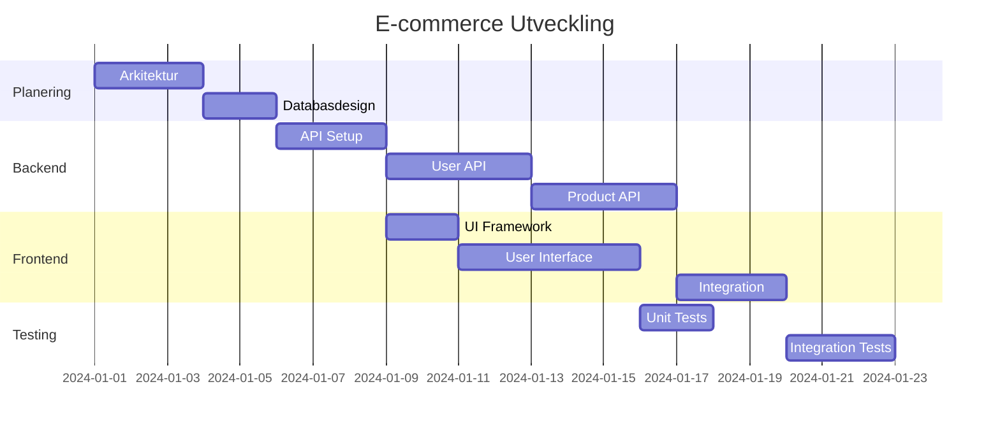
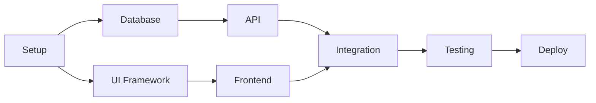

# Att Dela Upp Programmeringsuppgifter i Hanterbara Bitar 🧩

## Inledning

En av de viktigaste färdigheterna för en programmerare är konsten att dela upp stora, komplexa uppgifter i mindre, hanterbara delar. Denna teknik, kallad uppgiftsdekomposition, är fundamentalt för framgångsrik mjukvaruutveckling.

Precis som man inte äter en hel pizza på en gång, bör man inte försöka lösa alla aspekter av ett programmeringsproblem samtidigt. Genom att bryta ner uppgifter blir de mindre överväldigande och mer lösningsbara.

## Varför Dela Upp Uppgifter?

### Fördelar med Uppgiftsdekomposition

1. **Minskad Komplexitet**: Mindre problem är lättare att förstå och lösa
2. **Bättre Fokus**: Du kan koncentrera dig på en sak i taget
3. **Lättare Testning**: Små delar kan testas isolerat
4. **Parallell Utveckling**: Olika teammedlemmar kan arbeta på olika delar
5. **Bättre Prognosticering**: Lättare att uppskatta tid och resurser
6. **Mindre Risk**: Misstag påverkar mindre delar av systemet
7. **Förbättrad Motivation**: Frekventa "wins" när delar slutförs

### Psykologiska Fördelar

- **Minskar Ångest**: Stora uppgifter kan kännas överväldigande
- **Ökar Motivation**: Småframgångar skapar momentum
- **Förbättrar Självförtroende**: Framgång med små delar bygger tillit
- **Gör Framsteg Synligt**: Lätt att se vad som åstadkommits

## Metoder för Uppgiftsdekomposition

### 1. Top-Down Approach

Börja med övergripande mål och bryt ner steg för steg:

```plaintext
Huvuduppgift: Bygg E-commerce Webbsida
├── Frontend
│   ├── Produktlistning
│   ├── Kundkorg
│   └── Betalning
├── Backend
│   ├── Databasdesign
│   ├── API:er
│   └── Användarhantering
└── Deployment
    ├── Hosting
    └── Domän setup
```

### 2. Bottom-Up Approach

Börja med grundläggande komponenter och bygg uppåt:

```plaintext
Grundkomponenter:
1. Datamodeller (User, Product, Order)
2. Grundläggande CRUD-operationer
3. Autentisering
4. Enkla vyer

Kombinera till:
- Användarhantering
- Produkthantering
- Orderhantering
- Komplett applikation
```

### 3. MoSCoW-Metoden

Prioritera features baserat på viktighet:

- **Must have**: Kritiska funktioner som måste finnas
- **Should have**: Viktiga men inte kritiska
- **Could have**: Bra att ha om tid finns
- **Won't have**: Inte denna iteration

### 4. User Story Mapping

Bryt ner från användarens perspektiv:

```plaintext
Som kund vill jag...
├── ...kunna se produkter
│   ├── Lista alla produkter
│   ├── Filtrera produkter
│   └── Sök produkter
├── ...kunna handla
│   ├── Lägg till i kundkorg
│   ├── Ändra kvantitet
│   └── Checkout
└── ...hantera mitt konto
    ├── Registrera konto
    ├── Logga in
    └── Visa orderhistorik
```

## Praktiska Tekniker

### 1. Pseudokod för Planering

Innan du kodar, skissa logiken:

```plaintext
Program: Enkel Kalkylator

Huvudloop:
  Visa meny med operationer
  Läs användarens val

  Om val = "addition":
    Läs första talet
    Läs andra talet
    Beräkna summa
    Visa resultat

  Om val = "avsluta":
    Avsluta program

  Upprepa tills användaren avslutar
```

### 2. Task Lists och Kanban

**Enkel Task List:**
```plaintext
TODO:
□ Skapa databasschema
□ Implementera User-klass
□ Skapa login-formulär
□ Testa inloggning
□ Skapa användarregistrering

IN PROGRESS:
□ Implementera lösenordshashning

DONE:
☑ Sätt upp utvecklingsmiljö
☑ Skapa grundläggande projektstruktur
```

**Kanban Board:**
```plaintext
| BACKLOG      | TODO         | IN PROGRESS  | TESTING      | DONE         |
|------------- |------------- |------------- |------------- |------------- |
| Admin panel  | User login   | Password     | Database     | Project      |
| Reports      | Product CRUD | validation   | connection   | setup        |
| Email notify | Shopping cart|              |              | User model   |
```

### 3. Timeboxing

Sätt tidsbegränsningar för uppgifter:

```plaintext
Sprint 1 (2 veckor):
- Week 1: Databasdesign och grundmodeller
- Week 2: Grundläggande CRUD-operationer

Sprint 2 (2 veckor):
- Week 1: Användarautentisering
- Week 2: Frontend för användarhantering
```

## Agila Metoder för Uppgiftsdekomposition

### Scrum Approach

1. **Epic**: Stor funktionalitet (ex: Användarhantering)
2. **User Story**: Specifik användarfunktion (ex: Användare kan logga in)
3. **Task**: Teknisk implementation (ex: Skapa login-form)
4. **Subtask**: Detaljerade steg (ex: Validera email-format)

### Sprint Planning

```plaintext
Sprint Goal: Implementera grundläggande användarfunktioner

User Stories:
1. Som användare vill jag kunna registrera konto
   - Skapa registreringsformulär
   - Implementera validering
   - Spara användare i databas
   - Skicka bekräftelsemail

2. Som användare vill jag kunna logga in
   - Skapa login-formulär
   - Implementera autentisering
   - Hantera sessioner
   - Redirect till dashboard

3. Som användare vill jag kunna återställa lösenord
   - Skapa "glömt lösenord"-funktion
   - Skicka reset-email
   - Implementera lösenordsuppdatering
```

## Visualisering av Uppgifter

### Flödesscheman



### Gantt-schema



### Work Breakdown Structure (WBS)

```plaintext
1.0 E-commerce Webbsida
  1.1 Projektledning
    1.1.1 Planering
    1.1.2 Uppföljning
    1.1.3 Dokumentation

  1.2 Backend Utveckling
    1.2.1 Databasdesign
      1.2.1.1 ER-diagram
      1.2.1.2 Tabellskapande
      1.2.1.3 Indexering
    1.2.2 API Utveckling
      1.2.2.1 User endpoints
      1.2.2.2 Product endpoints
      1.2.2.3 Order endpoints

  1.3 Frontend Utveckling
    1.3.1 UI Design
    1.3.2 Component Development
    1.3.3 Integration
```

## Uppgiftshantering Tools

### Digitala Verktyg

- **Trello**: Enkla Kanban-boards
- **Jira**: Avancerad ärendehantering
- **GitHub Issues**: Integrerat med kod
- **Azure DevOps**: Microsoft's projekthantering
- **Notion**: Flexibel dokumentation och uppgifter

### Enklare Metoder

- **Papper och penna**: För snabb brainstorming
- **Sticky notes**: Fysiska Kanban-boards
- **Enkla textfiler**: För att-göra-listor
- **Spreadsheets**: Strukturerade uppgiftslistor

## Best Practices

### 1. SMART-mål för Uppgifter

Varje uppgift bör vara:
- **Specific**: Tydligt definierad
- **Measurable**: Mätbar framgång
- **Achievable**: Realistiskt genomförbar
- **Relevant**: Bidrar till huvudmålet
- **Time-bound**: Har en deadline

### 2. Estimation Techniques

**Fibonacci Estimering:**
- 1: Mycket enkel (1 timme)
- 2: Enkel (2-3 timmar)
- 3: Medium (halv dag)
- 5: Komplex (hel dag)
- 8: Mycket komplex (flera dagar)

**T-shirt Sizing:**
- XS: < 1 timme
- S: 1-4 timmar
- M: 1-2 dagar
- L: 3-5 dagar
- XL: > 1 vecka (dela upp!)

### 3. Definition of Done

Definiera när en uppgift är klar:

```plaintext
En uppgift är klar när:
□ Koden är skriven och testad
□ Unit tests är implementerade och passerar
□ Koden är granskad (code review)
□ Dokumentation är uppdaterad
□ Funktionen är testad i staging-miljö
□ Acceptanskriterier är uppfyllda
```

## Vanliga Fallgropar

### 1. För Stora Uppgifter

**Problem**: Uppgifter som tar mer än en dag
**Lösning**: Fortsätt dela upp tills varje del tar max 8 timmar

### 2. För Specifika Uppgifter

**Problem**: Mikro-management av varje steg
**Lösning**: Hitta rätt granularitet - tillräckligt detaljerad för att vara tydlig, men inte så detaljerad att det blir omöjligt att hantera

### 3. Glömma Beroenden

**Problem**: Uppgifter som inte kan börjas för andra inte är klara
**Lösning**: Rita upp beroendediagram och planera i rätt ordning

### 4. Inte Uppdatera Planer

**Problem**: Hålla fast vid ursprunglig plan trots ny information
**Lösning**: Revidera och anpassa planer regelbundet

## Övningsuppgifter

### Uppgift 1: Projektdekomposition

Ta detta projektbeskrivning och dela upp det i hanterbara uppgifter:
"Skapa en bloggapplikation där användare kan registrera konto, skriva blogginlägg, kommentera andras inlägg och söka bland alla inlägg."

Skapa:
- En uppgiftslista med minst 15 specifika uppgifter
- Prioritera uppgifterna (MoSCoW)
- Uppskatta tid för varje uppgift

### Uppgift 2: User Story Mapping

Skapa user stories för en enkel kalkylatorapp med dessa krav:
- Grundläggande räkneoperationer (+, -, *, /)
- Minnesfunktioner (M+, M-, MC, MR)
- Historik av beräkningar
- Export av historik

### Uppgift 3: Sprint Planning

Planera en 2-veckors sprint för utveckling av en biblioteks-hanteringsystem. Inkludera:
- Sprint goal
- 3-5 user stories
- Uppdelning i tasks
- Tidsestimering

### Uppgift 4: Kanban Board

Skapa en Kanban board för ditt aktuella programmeringsprojekt eller ett påhittat projekt. Inkludera minst 10 uppgifter fördelade över kolumnerna.

### Uppgift 5: Reflektion

Tänk på ett programmeringsprojekt du arbetat på tidigare. Skriv en reflektion (300-400 ord) om:
- Hur du delade upp uppgifterna
- Vad som fungerade bra
- Vad du skulle göra annorlunda
- Vilka tekniker från denna guide du kommer att prova

## Avancerade Tekniker

### 1. Impact vs Effort Matrix

Prioritera uppgifter baserat på värde och komplexitet:

```plaintext
    Hög Impact
         ↑
Låg   [Do First]    [Plan Carefully]   Hög
Effort ←                              → Effort
      [Fill In]     [Eliminate]
         ↓
    Låg Impact
```

### 2. Critical Path Method (CPM)

Identifiera den längsta kedjan av beroende uppgifter:



### 3. Risk-baserad Prioritering

Prioritera baserat på risk och osäkerhet:
- **Hög Risk**: Tackla tidigt för att minska osäkerhet
- **Teknisk Skuld**: Balansera mot ny funktionalitet
- **Beroenden**: Prioritera uppgifter som andra väntar på

## Sammanfattning

Effektiv uppgiftsdekomposition är nyckeln till framgångsrik mjukvaruutveckling. Genom att:

1. **Bryta ner stora problem** i mindre, hanterbara delar
2. **Använda lämpliga verktyg** för att spåra och visualisera framsteg
3. **Tillämpa agila metoder** för flexibel planering
4. **Kontinuerligt revidera** och förbättra din approach

...kommer du att kunna tackla även de mest komplexa programmeringsprojekten med självförtroende och struktur.

Kom ihåg: Det är bättre att planera lite för mycket än för lite. En bra plan kan alltid justeras, men ingen plan leder ofta till kaos och förvirring.

Lycka till med dina framtida projekt! 🚀

