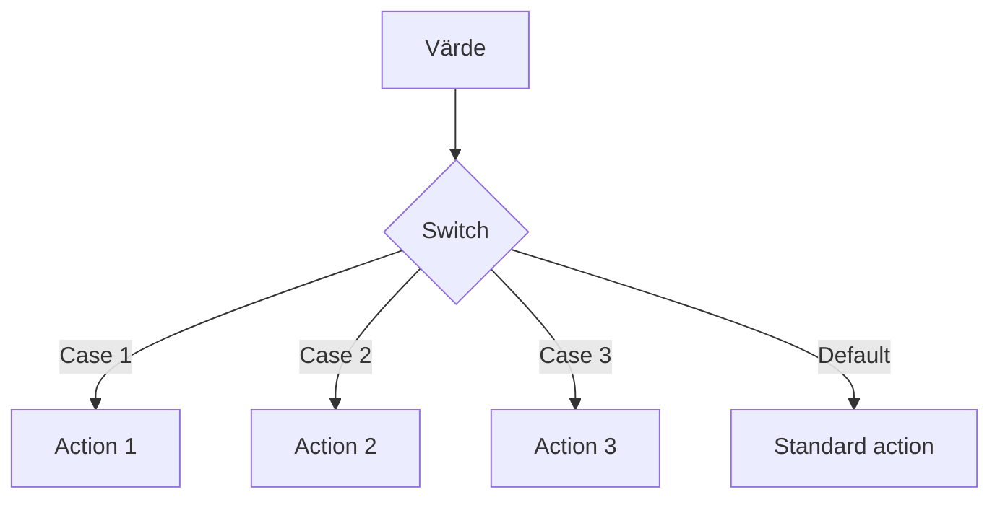

# 

# **Switch & Switch Expressions**

### Från grundläggande switch till moderna expressions

---

## **Varför ska vi ens bry oss om Switch?**

Tänk dig att du är Wolverine och måste välja vapen baserat på hotet framför dig.

Du har claws för närstrijd, laser-ögon för avstånd, och stealth för smyg.

Men du kan inte bara ha en jättelång if-else-kedja för varje möjligt hot!

Switch är din **taktiska väljare** - snabb, tydlig och elegant.

---

## **Kärnan i Switch**

Summan av kardemumman är egentligen ganska enkel:

- **Traditionell switch**: Som en gammal menysystem från 90-talet
- **Switch expression**: Som en modern smartphone-app - snyggare och smartare
- **Pattern matching**: Som Sherlock Holmes deduktioner

<div class="mermaid">



</div>

Hängde du med? Det är som att ha en superkraft för att sortera beslut!

---

## **Traditionell Switch - Klassikern**

Hur ser det ut i koden då?

```csharp
// Som att välja karaktär i Street Fighter
string characterName = "Ryu";

switch (characterName)
{
    case "Ryu":
        Console.WriteLine("Hadoken!");
        break;
    case "Chun-Li":
        Console.WriteLine("Spinning Bird Kick!");
        break;
    case "Blanka":
        Console.WriteLine("Electric Thunder!");
        break;
    default:
        Console.WriteLine("Choose your fighter!");
        break;
}
```

Ser du? Vi har en start, olika vägar och ett slut. Precis som när du väljer pizza-topping.

---

## **Switch Expression - Moderna superkrafter**

C# 8.0 gav oss switch expressions - som att uppgradera från Game Boy till Nintendo Switch!

```csharp
// Samma Street Fighter, men snyggare
string GetSpecialMove(string character) => character switch
{
    "Ryu" => "Hadoken!",
    "Chun-Li" => "Spinning Bird Kick!",
    "Blanka" => "Electric Thunder!",
    _ => "Choose your fighter!"
};

// Användning
string move = GetSpecialMove("Ryu");
Console.WriteLine(move); // Hadoken!
```

Mycket cleanare! Som att gå från Bruce Banner till Hulk - samma kraft, bättre form.

---

## **Pattern Matching - Jedi-nivå**

Nu blir det riktigt häftigt - pattern matching med typer:

```csharp
// Som att identifiera superhjältar baserat på deras krafter
public static string IdentifyHero(object power) => power switch
{
    string s when s.Contains("web") => "Spider-Man",
    int strength when strength > 1000 => "Superman",
    bool canFly when canFly => "Någon som kan flyga",
    null => "Vanlig människa",
    _ => "Okänd superhjälte"
};
```

Det är som att ha Cerebro från X-Men - du känner igen mönster omedelbart!

---

## **Dags att kavla upp ärmarna!**

Nu har ni fått grunderna. Teori är bra, men att faktiskt "koda vilt" är tusen gånger bättre.

Ni kommer nu att jobba i par eller smågrupper med några övningar.

**Målet**: Inte bara att skriva switch-statements, utan att prata kod och förstå när man använder vad.

---

## **Dagens övningar**

### **Övning 1: Grundläggande Switch**

Här får ni bygga en RPG-karaktärsväljare. Fokus på traditionella switch-statements.

### **Övning 2: Switch Expressions**

Nu uppgraderar vi till moderna switch expressions med pattern matching.

### **Övning 3: Real-world Application**

Bygg en shopping cart som hanterar olika produkttyper och rabatter.

**Kom ihåg**: Det är helt okej att det blir fel. Det är då vi lär oss!

---

## **Snyggt jobbat!**

Kör hårt nu. Fråga mig om ni fastnar.

Switch är eran nya superkraft för att hantera komplexa beslut i kod.

**Ni klarar det här!** 🚀

---

## **Källor & Resurser**

Allt material är skapat för utbildningssyfte.

- **Bakgrundsbild**: Kod och tangentbord via Pexels
- **Mermaid diagram**: Flödesschema för switch-logik
- **Kodexempel**: Originalexempel för undervisning

**Mer inspiration**:

- Microsoft Docs: Switch expressions
- Pattern matching in C#
