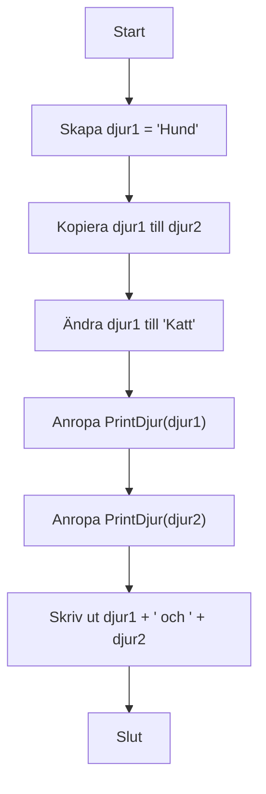

## Variabler och värden

Detta C#-program visar hur variabler fungerar och hur värden kopieras mellan dem. Det visar också hur metoder kan användas för att bearbeta och skriva ut data.

När du kopierar en variabel av typen string till en annan, får den nya variabeln samma värde som den gamla vid kopieringstillfället. Om du ändrar värdet på den första variabeln efteråt, påverkas inte den andra.

```csharp
// Skapar en variabel och ger den värdet "Hund"
string djur1 = "Hund";
// Kopierar värdet från djur1 till djur2
string djur2 = djur1;

// Ändrar värdet på djur1 till "Katt"
djur1= "Katt";

// Anropar metoden PrintDjur med djur1 och djur2
PrintDjur(djur1);
PrintDjur(djur2);

// Skriver ut båda djurens namn
Console.WriteLine(djur1 + " och " + djur2);

// En metod som lägger till text till djurets namn och skriver ut det
// Denna metod ändrar inte den ursprungliga variabeln utanför metoden
// den får en kopia av värdet. Viktigt att komma ihåg!
void PrintDjur(string djur)
{
    djur += " är hårig";
    Console.WriteLine("Djur: " + djur);
}
```

Här är ett diagram som visar hur programmet fungerar:



Programmet visar att djur2 behåller sitt ursprungliga värde även om djur1 ändras efter kopieringen.
