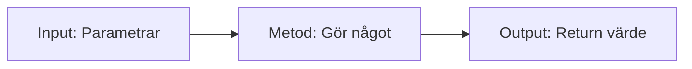

<!-- _class: lead -->
<!-- _backgroundImage: url('https://images.unsplash.com/photo-1607799279861-4dd421887fb3?ixlib=rb-4.0.3&auto=format&fit=crop&w=1920&q=80') -->

# Metoder i C# 🛠️

## En 15-minuters guide för nybörjare

_Campus Mölndal - CLO25_
_Objektorienterad Programmering_

---

## Vad är en Metod? 🤔

En **metod** är som en **mini-program** i ditt program!

```csharp
static void SägHej()
{
    Console.WriteLine("Hej från metoden!");
}
```

**Tänk på det som:** En låda som gör något specifikt när du ber den.

---

## Varför använder vi Metoder? 💡

**Utan metoder (upprepa kod):**

```csharp
Console.WriteLine("Beräknar area...");
double area1 = 5 * 3;
Console.WriteLine($"Area: {area1}");

Console.WriteLine("Beräknar area...");
double area2 = 8 * 4;
Console.WriteLine($"Area: {area2}");
```

**Med metod (DRY - Don't Repeat Yourself):**

```csharp
static double BeräknaArea(double längd, double bredd)
{
    return längd * bredd;
}
```

---

## Metodens Anatomi 🔬

```csharp
// åtkomst (public/private/internal/protected) [static] returntyp in parametrar
public static returnTyp (string/int/etc)  MethodNamn(parameter1, parameter2)
{
    // Metodens kod
    return värde; // Om returnTyp inte är void
}
```

<div class="mermaid">




</div>

---

## Enkla Metoder - Void (Ingen Return) 🗣️

```csharp
static void SägHej()
{
    Console.WriteLine("Hej!");
}

static void SägHejTill(string namn)
{
    Console.WriteLine($"Hej {namn}!");
}

// Användning:
SägHej();           // Output: Hej!
SägHejTill("Anna"); // Output: Hej Anna!
```

**Void = gör något, men returnerar inget**

---

## Metoder med Return Value 📤

```csharp
static int Addera(int tal1, int tal2)
{
    return tal1 + tal2;
}

static string FåFulltNamn(string förnamn, string efternamn)
{
    return förnamn + " " + efternamn;
}

// Användning:
int summa = Addera(5, 3);        // summa = 8
string namn = FåFulltNamn("Anna", "Andersson"); // "Anna Andersson"
```

---

## Parametrar vs Argument 📊

```csharp
static void Hälsa(string namn, int ålder) // namn & ålder = PARAMETRAR
{
    Console.WriteLine($"Hej {namn}, du är {ålder} år!");
}

// Vid anrop:
Hälsa("Bertil", 25); // "Bertil" & 25 = ARGUMENT
```

**Kom ihåg:**

- **Parametrar** = variabler i metoddefinitionen
- **Argument** = faktiska värden du skickar in

---

## Exempel: Kalkylator Metoder 🧮

```csharp
static double Addera(double a, double b)
{
    return a + b;
}

static double Multiplicera(double a, double b)
{
    return a * b;
}

static bool ÄrJämnt(int tal)
{
    return tal % 2 == 0;
}

// Användning:
Console.WriteLine(Addera(10.5, 5.2));     // 15.7
Console.WriteLine(Multiplicera(4, 2.5));  // 10.0
Console.WriteLine(ÄrJämnt(8));            // True
```

---

## Method Overloading 🔄

Samma metodnamn, olika parametrar!

```csharp
static void SkrivInfo(string namn)
{
    Console.WriteLine($"Namn: {namn}");
}

static void SkrivInfo(string namn, int ålder)
{
    Console.WriteLine($"Namn: {namn}, Ålder: {ålder}");
}

static void SkrivInfo(string namn, int ålder, string stad)
{
    Console.WriteLine($"Namn: {namn}, Ålder: {ålder}, Stad: {stad}");
}
```

C# väljer **automatiskt** rätt metod baserat på argument!

---

## Scope - Var Lever Variablerna? 🏠

```csharp
static void ExempelMetod()
{
    int lokalVariabel = 10; // Finns bara i denna metod
    Console.WriteLine(lokalVariabel);
} // lokalVariabel "dör" här

static void Main()
{
    int mainVariabel = 5;
    ExempelMetod();
    // Console.WriteLine(lokalVariabel); // FEL! Finns inte här
}
```

**Regel:** Variabler lever bara inom sina klammerparenteser `{ }`

---

## Praktiskt Exempel: String Metoder 📝

```csharp
static string GörStorBokstav(string text)
{
    if (string.IsNullOrEmpty(text))
        return text;

    return text.Substring(0, 1).ToUpper() + text.Substring(1).ToLower();
}

static bool InnehållerSiffra(string text)
{
    for (int i = 0; i < text.Length; i++)
    {
        if (char.IsDigit(text[i]))
            return true;
    }
    return false;
}
// Test:
Console.WriteLine(GörStorBokstav("hELLO")); // "Hello"
Console.WriteLine(InnehållerSiffra("abc123")); // True
```

---

## Out och Ref Parametrar 🔄

### Out - Metoden MÅSTE ge värde

```csharp
static bool TryParseInt(string text, out int resultat)
{
    if (int.TryParse(text, out resultat))
        return true;

    resultat = 0;
    return false;
}

// Användning:
if (TryParseInt("123", out int tal))
    Console.WriteLine($"Lyckades: {tal}");
```

---

### Ref - Ändra befintligt värde

```csharp
static void DubbleraVärde(ref int tal)
{
    tal = tal * 2;
}
```

---

## Vanliga Misstag ⚠️

### 1. Glöm return

```csharp
static int Addera(int a, int b)
{
    int summa = a + b;
    // Glömt: return summa;
}
```

---

### 2. Fel parameterordning

```csharp
static double Dividera(double täljare, double nämnare)
{
    return täljare / nämnare;
}

// FEL ordning kan ge fel resultat!
double fel = Dividera(2, 10);    // 0.2
double rätt = Dividera(10, 2);   // 5.0
```

---

## Debugging Metoder 🐛

```csharp
static void DebugMetod(string metodNamn, object värde)
{
    Console.WriteLine($"[DEBUG] {metodNamn}: {värde}");
}

static int BeräknaSomething(int input)
{
    DebugMetod("BeräknaSomething - Input", input);

    int resultat = input * 2 + 5;

    DebugMetod("BeräknaSomething - Output", resultat);
    return resultat;
}
```

**Bra för att förstå vad som händer i dina metoder!**

---

## Övningar för dig! 🎯

### Övning 1: Temperatur Konverterare

```csharp
static double CelsiusTillFahrenheit(double celsius)
{
    // Din kod här: (celsius * 9/5) + 32
}
```

---

### Övning 2: Är Primtal?

```csharp
static bool ÄrPrimtal(int tal)
{
    // Din kod här: returnera true om tal är primtal
}
```

---

### Övning 3: Räkna Ord

```csharp
static int RäknaOrd(string text)
{
    // Din kod här: räkna antal ord i texten
}
```

---

## Sammanfattning 📝

✅ **Metoder** = återanvändbar kod i "lådor"
✅ **Void metoder** gör något, **Return metoder** ger tillbaka värde
✅ **Parametrar** = input, **Return** = output
✅ **Overloading** = samma namn, olika parametrar
✅ **Scope** = variabler lever inom `{ }`
✅ **Best practice** = små, specifika, välnamnade metoder

---

<!-- _class: lead -->

<!-- _backgroundColor: #f9f9f9 -->

# Frågor? 🙋‍♂️

**Kom ihåg:**
Metoder = koden blir mer organiserad!

En metod = en uppgift! 💻

---

## Nästa steg 🚀

1. **Skapa** enkla void metoder
2. **Experimentera** med return värden
3. **Bryt ner** stora problem i små metoder
4. **Använd** method overloading när det passar
5. **Organisera** din kod med logiska metoder

**Keep it simple, keep it clean!** 🎉
