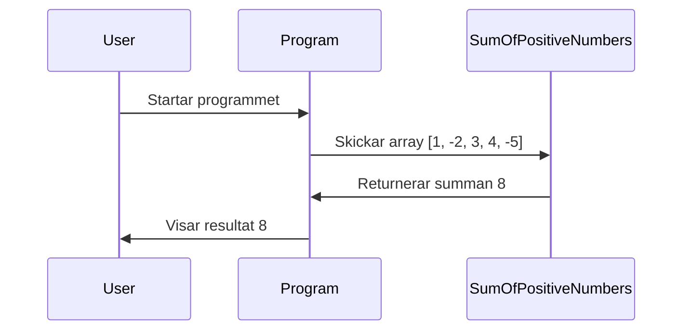

### Summan av positiva tal i en array

**Intro:**
Vi ska öva lite på problemlösning i programmering. Du har en array av heltal och uppgiften är att räkna ut summan av alla positiva tal. Låter simpelt, eller hur? Men som alltid finns det flera sätt att tänka och lösa uppgiften på. Låt oss bryta ner det steg för steg.

**Förväntad output:**
```text
Anta att vi skickar in [1, -2, 3, 4, -5], då borde vi få tillbaka 8 (eftersom 1 + 3 + 4 = 8).
```

<details>
  <summary>Tips på hur man tänker</summary>

  Okej, jag har en massa tal och ska kolla på var och en. Hur gör jag bäst för att hitta de positiva talen? Jag kan ju bara loopa genom listan och undersöka om varje tal är större än noll. Men vänta... vad händer om jag glömmer att noll också är "inte positiv"? Hmm, kanske enklaste lösningen är att bara säga: "Om talet är större än noll, då lägger jag till det i en summa." Det känns rätt säkert och enkelt att implementera.

  Okej, vi loopar, kollar varje tal och lägger till de positiva. Voilà!
</details>

<details>
  <summary>Pseudokod</summary>

  ```
  Starta en metod som tar in en array av heltal.
  Skapa en variabel för att hålla summan.
  Loopa genom arrayen.
    Om talet är större än noll, lägg till det i summan.
  Returnera summan.
  ```
</details>


**Sekvensdiagram:**
<div class="mermaid" style="zoom: 1.4;">



</div>

<details>
  <summary>Förslag på lösning</summary>

**Kodexempel:**

```csharp
using System;

class Program
{
    static void Main()
    {
        int[] numbers = { 1, -2, 3, 4, -5 };  // Vår test-array
        int result = SumOfPositiveNumbers(numbers);
        Console.WriteLine(result);  // Förväntat output: 8
    }

    // Metod som summerar alla positiva tal i arrayen.
    static int SumOfPositiveNumbers(int[] numbers)
    {
        int sum = 0;  // Här lagras summan.

        // Loopar genom varje tal i arrayen.
        foreach (int number in numbers)
        {
            if (number > 0)  // Om talet är positivt...
            {
                sum += number;  // Lägg till talet till summan.
            }
        }

        return sum;  // Returnerar summan.
    }
}
```

Så här tänker vi: om vi skickar in en array med tal som `[1, -2, 3, 4, -5]`, borde vi få tillbaka summan 8. Det här är en bra övning på hur man filtrerar ut vissa värden ur en lista och utför en operation på dem.

</details>
