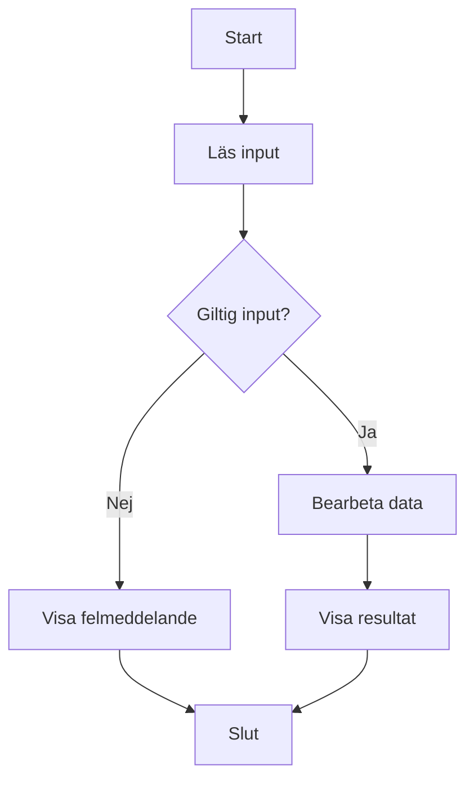
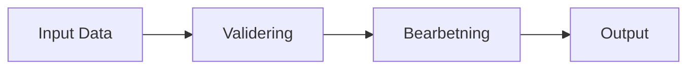
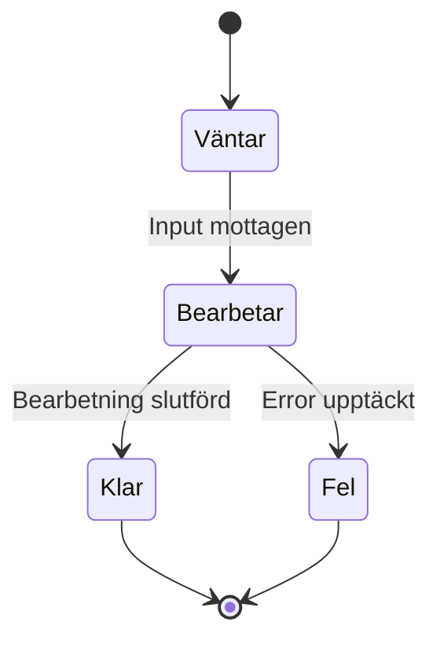

# Att Tänka som en Programmerare och Planera Sin Kod 🤖

## Inledning

Programmering handlar inte bara om att skriva kod - det handlar om att utveckla ett särskilt sätt att tänka. Som programmerare behöver du kunna bryta ner komplexa problem, tänka logiskt och systematiskt, samt ha en strukturerad approach till problemlösning.

Den här guiden hjälper dig att utveckla det "programmerartänk" som är grunden för all framgångsrik mjukvaruutveckling.

## Vad är Programmerartänk?

Programmerartänk är en kombination av:
- **Logiskt tänkande**: Att följa orsak-verkan kedjan
- **Systematisk problemlösning**: Att bryta ner stora problem i mindre delar
- **Abstrakt tänkande**: Att identifiera mönster och generalisera lösningar
- **Iterativ utveckling**: Att förbättra lösningar steg för steg
- **Resiliens**: Att inte ge upp när något inte fungerar

## Grundläggande Principer

### 1. Förstå Problemet Först

Innan du börjar koda, se till att du verkligen förstår vad som ska lösas.

**Ställ dig frågorna:**
- Vad är det egentliga problemet?
- Vilka är kraven och begränsningarna?
- Vad är input och output?
- Finns det edge cases att tänka på?

**Exempel:**
```plaintext
Problem: "Skapa ett program som beräknar genomsnittet av en lista med tal"

Fördjupande frågor:
- Vad händer om listan är tom?
- Ska negativa tal hanteras speciellt?
- Vilken precision behövs på resultatet?
- Ska programmet hantera ogiltiga värden?
```

### 2. Dela Upp och Härska (Divide and Conquer)

Bryt ner stora problem i mindre, hanterbara delar.

**Strategi:**
1. Identifiera huvudkomponenterna
2. Dela upp varje komponent i mindre delar
3. Lös en del i taget
4. Kombinera lösningarna

**Exempel - Filsökningsprogram:**
```plaintext
Huvudproblem: Sök igenom fil efter mönster

Deluppgifter:
1. Läsa in fil
   - Öppna fil
   - Hantera filfel
   - Läsa rad för rad

2. Söka efter mönster
   - Definiera sökmönster
   - Jämföra mot varje rad
   - Hantera olika jämförelsemodi

3. Visa resultat
   - Formatera output
   - Visa radnummer
   - Markera matchningar
```

### 3. Tänk i Algoritmer och Datastrukturer

Lär dig att identifiera vilka algoritmer och datastrukturer som passar för olika problem.

**Vanliga mönster:**
- **Lista/Array**: För sekventiell data
- **Dictionary/Map**: För nyckel-värde kopplingar
- **Stack**: För LIFO (Last In, First Out) operationer
- **Queue**: För FIFO (First In, First Out) operationer
- **Loops**: För upprepning
- **Conditionals**: För beslut

### 4. Använd Pseudokod

Planera din lösning med pseudokod innan du skriver riktig kod.

**Exempel:**
```plaintext
Funktion BeräknaGenomsnitt(talLista):
  OM talLista är tom:
    RETURNERA fel eller 0

  summa = 0
  FÖR varje tal i talLista:
    summa = summa + tal

  genomsnitt = summa / antal tal i listan
  RETURNERA genomsnitt
```

## Mental Modellering

### Visualisera Problemet

Använd olika tekniker för att visualisera problemet:

**1. Flödesscheman**


**2. Dataflödesdiagram**


**3. Tillståndsdiagram**


## Iterativ Utveckling

### Start Small, Think Big

Börja med den enklaste versionen som fungerar, sedan förbättra den.

**Utvecklingsprocess:**
1. **MVP (Minimum Viable Product)**: Grundfunktionalitet
2. **Iteration 1**: Lägg till grundläggande features
3. **Iteration 2**: Förbättra felhantering
4. **Iteration 3**: Optimera prestanda
5. **Iteration 4**: Förbättra användarvänlighet

### Exempel - Kalkylatorutveckling

```plaintext
Version 1: Enkel addition
  - Läs två tal
  - Addera dem
  - Visa resultat

Version 2: Flera operationer
  - Lägg till subtraktion, multiplikation, division
  - Använd operator-input

Version 3: Felhantering
  - Hantera division med noll
  - Validera input

Version 4: Avancerade funktioner
  - Lägg till minne-funktioner
  - Historik av beräkningar
```

## Felsökning och Problemlösning

### Systematisk Felsökning

1. **Reproducera felet**: Kan du få det att hända igen?
2. **Isolera problemet**: Var i koden uppstår felet?
3. **Formullera hypotes**: Vad tror du orsakar felet?
4. **Testa hypotesen**: Ändra en sak i taget
5. **Verifiera lösningen**: Fungerar det nu som förväntat?

### Debugging-tekniker

**1. Print-debugging**
```csharp
Console.WriteLine($"Debug: variabel = {variabel}");
```

**2. Stegvis körning**
- Använd debugger
- Sätt breakpoints
- Inspektera variabler

**3. Rubber Duck Debugging**
- Förklara problemet för en gummianka (eller kollega)
- Ofta hittar du lösningen medan du förklarar

## Utveckla Problemlösningsstrategier

### När du Kör Fast

1. **Ta en paus**: Gå iväg från datorn
2. **Förklara problemet**: För någon annan eller för dig själv
3. **Bryt ner ytterligare**: Gör problemet ännu mindre
4. **Sök efter inspiration**: Kolla dokumentation, exempel online
5. **Fråga om hjälp**: Kollegor, lärare, online communities

### Lär från Andras Kod

- Läs open source-projekt
- Studera välskriven kod
- Förstå designmönster
- Analysera olika lösningsansatser

## Kommunikation och Dokumentation

### Skriv för Människor

Kod läses oftare än den skrivs. Gör den läsbar:

```csharp
// Dåligt
int x = u * 0.1;

// Bra
int discountAmount = unitPrice * DISCOUNT_RATE;
```

### Kommentera Klokt

Kommentera "varför", inte "vad":

```csharp
// Dåligt
i++; // Öka i med 1

// Bra
i++; // Gå till nästa element för att undvika dubbel-bearbetning
```

## Övningsuppgifter

### Uppgift 1: Problemanalys

Analysera detta problem och bryt ner det i mindre delar:
"Skapa ett system för att hantera biblioteksböcker där användare kan låna och återlämna böcker."

### Uppgift 2: Pseudokod-praktik

Skriv pseudokod för en funktion som:
- Tar emot en lista med ord
- Returnerar det längsta ordet
- Hanterar tomma listor och lika långa ord

### Uppgift 3: Mental modellering

Rita upp ett flödesschema för en ATM-maskin som hanterar:
- PIN-verifiering
- Kontobalanskontroll
- Uttag
- Felhantering

### Uppgift 4: Iterativ utveckling

Planera en utvecklingsprocess för en enkel chattapplikation. Definiera vad som ska ingå i varje iteration.

### Uppgift 5: Felsökning

Du har en funktion som ska sortera en lista, men den fungerar inte korrekt. Beskriv en systematisk approach för att hitta och fixa problemet.

## Verktyg och Tekniker

### Planering och Design

- **Flödesscheman**: Visualisera logiskt flöde
- **UML-diagram**: Modellera klasser och relationer
- **Wireframes**: Planera användargränssnitt
- **User stories**: Definiera krav från användarens perspektiv

### Utvecklingsverktyg

- **IDE**: Visual Studio, VS Code
- **Versionskontroll**: Git
- **Debugging**: Breakpoints, watch-windows
- **Testing**: Unit tests, integration tests

### Lärande och Reflektion

- **Code reviews**: Få feedback på din kod
- **Retrospectives**: Reflektera över vad som fungerade
- **Teknisk dokumentation**: Dokumentera designbeslut
- **Bloggande**: Skriv om vad du lär dig

## Vanliga Fallgropar och Hur Man Undviker Dem

### 1. Optimera för Tidigt

**Problem**: Fokusera på prestanda innan koden fungerar
**Lösning**: Få det att fungera först, optimera sedan

### 2. Överkomplicera Lösningar

**Problem**: Försöka lösa problem som inte finns
**Lösning**: Följ YAGNI (You Ain't Gonna Need It)

### 3. Inte Testa Tillräckligt

**Problem**: Anta att koden fungerar utan att testa
**Lösning**: Testa tidigt och ofta

### 4. Inte Läsa Felmeddelanden

**Problem**: Panikera vid fel istället för att läsa meddelandet
**Lösning**: Läs felmeddelandet noggrant - det berättar ofta vad som är fel

## Utveckla Ditt Programmerartänk

### Dagliga Vanor

1. **Koda regelbundet**: Övning ger färdighet
2. **Läs andras kod**: Lär från olika stilar
3. **Reflektera**: Vad fungerade bra idag? Vad kan förbättras?
4. **Experimentera**: Prova nya tekniker och verktyg
5. **Undervisa**: Förklara koncept för andra

### Långsiktiga Mål

- Bygg en portfölj av projekt
- Bidra till open source-projekt
- Deltag i programmeringscommunitys
- Håll dig uppdaterad med nya teknologier
- Utveckla specialistkunskap inom intresseområden

## Sammanfattning

Att tänka som en programmerare är en färdighet som utvecklas över tid. De viktiga grundstenarna är:

1. **Förstå problemet** innan du börjar koda
2. **Bryt ner komplexa problem** i mindre delar
3. **Använd pseudokod** för att planera din lösning
4. **Utveckla iterativt** - börja enkelt och förbättra
5. **Var systematisk** i din felsökning
6. **Kommunicera tydligt** genom kod och kommentarer
7. **Lär kontinuerligt** från egna och andras erfarenheter

Kom ihåg: Programmering är lika mycket en mental disciplin som en teknisk färdighet. Ju mer du tränar ditt "programmerartänk", desto bättre programmerare blir du.

Lycka till på din resa! 🌟

