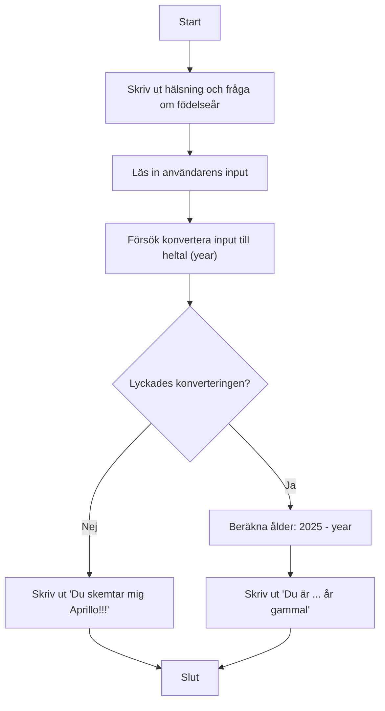

## Parsing och åldersberäkning

Parsering innebär att konvertera en sträng (text) till ett annat datatyp, som ett heltal (int) eller decimaltal (double).

Detta är ett C#-program som visar hur man läser in en sträng från användaren och försöker konvertera den till ett heltal (årtal). Om det lyckas räknar programmet ut användarens ålder, annars visas ett felmeddelande.

I verkliga program är det viktigt att kontrollera att användaren skriver in rätt typ av data, annars kan programmet krascha eller ge felaktiga resultat.

```csharp
using System;
{
// Huvudklassen i programmet
internal class Program
{
    // Huvudmetoden där programmet startar
    static void Main(string[] args)
    {
        // Skriver ut en hälsning
        Console.WriteLine("Hello, Parsing!");

        // Ber användaren ange sitt födelseår
        Console.WriteLine("När föddes du?");
        // Läser in det användaren skriver (alltid en textsträng)
        string input = Console.ReadLine();
        //int year = int.Parse(input); // Omvandla sträng till int (kommenterad)

        // Skapar en variabel för år och sätter den till 0
        int year = 0;
        // Försöker konvertera det användaren skrev till ett heltal (år)
        if (int.TryParse(input, out year)==true)
        {
            // Om konverteringen lyckades, beräkna åldern
            int age = 2025 - year;
            // Skriv ut åldern
            Console.WriteLine($"Du är {age} år gammal");
        }
        else // Om konverteringen misslyckades
        {
            // Meddelande om man inte skrev en siffra
            Console.WriteLine("Du skemtar mig Aprillo!!!");
        }
    }
}
```

Här är ett diagram som visar hur programmet fungerar:



Programmet är enkelt men visar tydligt hur man hanterar inmatning och konvertering i C#.
