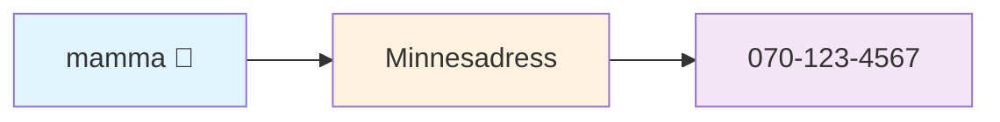
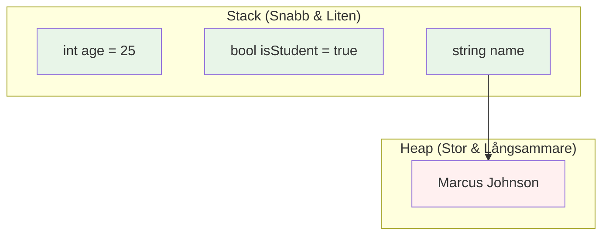
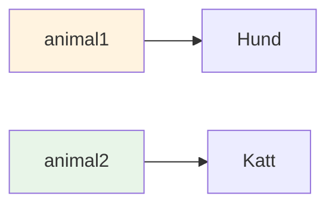

# Variabler och Minne
## Snabbguide (15 min föreläsning → kodtid!)

---

# Variabler = Märkta Lådor 📦

Tänk på variabler som kontakter i din telefon:



```csharp
string cat = "Whiskers";
// 'cat' är etiketten, "Whiskers" är det faktiska värdet i minnet
```

**Viktigt:** Variabelnamnet är bara en **genväg** till riktiga data!

---

# Minneslayout - Var Variabler Bor



**Siffror & booleans** = Stack | **Strängar & arrayer** = Heap (via referens)

---

# Viktiga Variabeltyper

```csharp
// Värdetyper (lagras direkt)
int age = 25;               // Heltal
bool passedTest = true;     // sant eller falskt
double price = 19.99;       // Decimaltal

// Referenstyper (lagras via pekare)  
string name = "Alice";      // Text
int[] scores = {85, 90, 78}; // Arrayer
```

**Regel:** Enkla typer = direkt lagring, Komplexa typer = referenslagring

---

# Variabeltilldelning - Magi! ✨

```csharp
string animal1 = "Katt";
string animal2 = animal1;    // Båda pekar på samma "Katt" 
animal1 = "Hund";           // animal1 pekar nu på ny "Hund"

Console.WriteLine(animal1); // Utskrift: "Hund"
Console.WriteLine(animal2); // Utskrift: "Katt"
```



**Resultat:** animal2 har fortfarande "Katt", animal1 har "Hund"

---

# Vanliga Fallgropar ⚠️

**1. Null-referenser:**
```csharp
string name = null;
Console.WriteLine(name.Length); // 💥 KRASCH!
```

**2. Värde vs Referens förvirring:**
```csharp
int a = 5;
int b = a;    // b får KOPIA av 5
a = 10;       // b är fortfarande 5

string x = "Hej";
string y = x; // y pekar på SAMMA "Hej"
```

---

# Snabb Övning

**Vi kodar tillsammans:**

1. Skapa variabler för studentinfo (name, age, grade)
2. Förstå vilket som går till Stack vs Heap
3. Öva tilldelning och se vad som händer i minnet
4. Bygg ett enkelt "student-register" program

---

# Sammanfattning - Variabler på 2 Minuter

✅ **Variabler** = märkta genvägar till minnesplatser  
✅ **Värdetyper** (int, bool, string (tyvärr)) = lagras direkt på Stack  
✅ **Referenstyper** (array, objekt) = lagras på Heap via pekare  
✅ **Tilldelning** = kopiera värden ELLER kopiera referenser  
✅ **Förstå detta** = bättre debugging & prestanda  

**Nu ska vi koda och se variabler i aktion! 🚀**